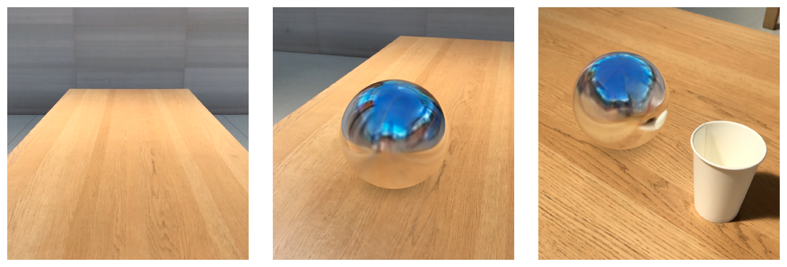
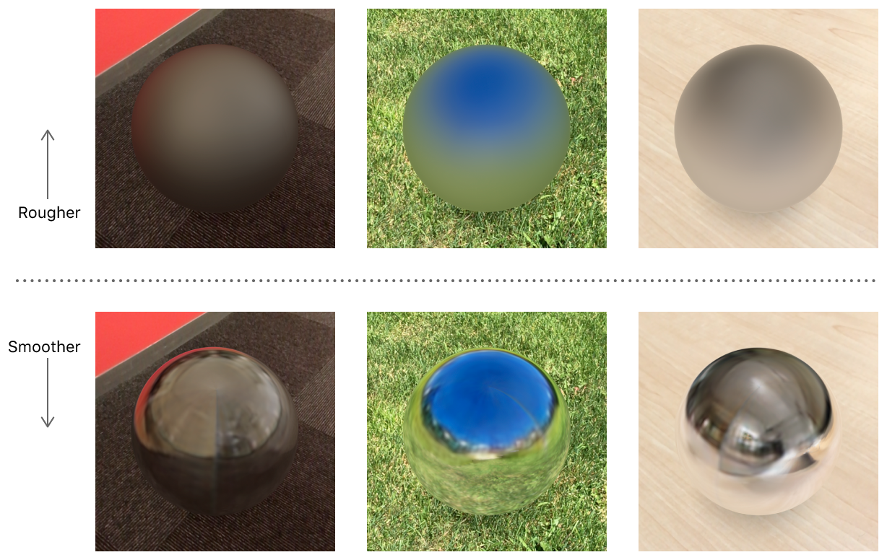
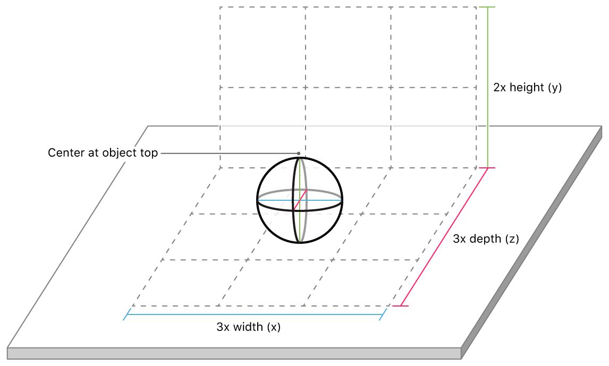

# Adding Realistic Reflections to an AR Experience

Use ARKit to generate environment probe textures from camera imagery and render reflective virtual objects.

## Overview

This app provides a simple AR experience demonstrating the environment texturing features in ARKit 2 and SceneKit. After you build and run the app, explore your surroundings in the camera view. Then, tap a nearby horizontal surface to place a virtual object: a mirror-finish sphere. After you place the object, you can drag it around or tap to move it to another location. You can also pinch to make the object bigger or smaller. 



Notice the surface of the virtual sphere shows a generally realistic (if not perfectly accurate) reflection of its real-world surroundings. To create reflective virtual surfaces, a renderer (such as SceneKit) needs an  *environment texture*—an image that captures the view in all directions from a certain point in the scene (called an *environment probe*). Realistically rendering reflections for multiple objects, or moving objects, may require multiple environment textures, each capturing the scene from a different point of view. 

ARKit generates environment textures by collecting camera imagery during the AR session. Because ARKit cannot see the scene in all directions, it uses machine learning to extrapolate a realistic environment from available imagery.

## Getting Started

Before you can run the sample code project, you'll need:

- Xcode 10 or later.
- iOS 12 or later.
- An iOS device with an A9 processor or later.

## Set Up Environment Texturing

As with any AR experience, you run a session with a world tracking configuration and whatever other options you want to enable. (For example, this app allows you to place virtual objects on flat surfaces, so it enables horizontal plane detection.) To generate environment textures, also set the configuration's [`environmentTexturing`][10] property:

``` swift
let configuration = ARWorldTrackingConfiguration()
configuration.planeDetection = .horizontal
configuration.environmentTexturing = .automatic
sceneView.session.run(configuration)
```
[View in Source](x-source-tag://RunARSession)

With [`automatic`][11] environment texturing (the default for this app) ARKit automatically chooses when and where to generate textures.

[10]:https://developer.apple.com/documentation/arkit/arworldtrackingconfiguration/2977509-environmenttexturing
[11]:https://developer.apple.com/documentation/arkit/arworldtrackingconfiguration/environmenttexturing/automatic

## Render Virtual Objects with Reflection

Because this app also uses [`ARSCNView`][20] to display AR content, SceneKit automatically uses the appropriate environment texture to render each virtual object in the scene. In SceneKit, any asset using [`physicallyBased`][21] materials automatically uses *environmental lighting*. With environmental lighting, the shading for each point on a surface depends on nearby light probe textures or the global lighting environment in the direction that point faces. 

The visual effect of environment texturing depends on how you configure the properties of a physically based material. (Typically, ) For example, materials with a high [`roughness`][22] pick up some diffuse color from the texture, and materials with low [`roughness`][22] and high [`metalness`][23] reflect their surroundings with a mirror-like finish.



- Note: If your AR experience uses a rendering technology other than SceneKit, you'll need to retrieve the generated textures yourself and determine how to use them appropriately in your shading engine. First, 
implement the [`session(_:didUpdate:)`][24] delegate method to be notified when ARKit generates environment probe textures. In that method, use the [`environmentTexture`][25] property of each [`AREnvironmentProbeAnchor`][26] object to get the texture.

[20]:https://developer.apple.com/documentation/arkit/arscnview
[21]:https://developer.apple.com/documentation/scenekit/scnmaterial/lightingmodel/1640553-physicallybased
[22]:https://developer.apple.com/documentation/scenekit/scnmaterial/1640555-roughness
[23]:https://developer.apple.com/documentation/scenekit/scnmaterial/1640554-metalness
[24]:https://developer.apple.com/documentation/arkit/arsessiondelegate/2865624-session
[25]:https://developer.apple.com/documentation/arkit/arenvironmentprobeanchor/2977511-environmenttexture
[26]:https://developer.apple.com/documentation/arkit/arenvironmentprobeanchor

## Place Environment Probes Manually for Enhanced Results

Automatic environment texturing is all you need for basic environmental lighting or reflection effects. To render reflections more realistically, however, each reflective object needs an environment probe texture that accurately captures the area close to that object. For example, in the images above, the virtual sphere reflects the real cup when the cup is close to the sphere's real-world position.

To more precisely define environment probes, choose [`manual`][30] environment texturing when you configure your AR session, then create your own [`AREnvironmentProbeAnchor`][26] instance for each virtual object you want to use environmental lighting with. Initialize each probe's [`extent`][31] and position (using [`transform`][32]) based on the size of the corresponding virtual object:

``` swift
// Make sure the probe encompasses the object and provides some surrounding area to appear in reflections.
var extent = object.extents * object.simdScale
extent.x *= 3 // Reflect an area 3x the width of the object.
extent.z *= 3 // Reflect an area 3x the depth of the object.

// Also include some vertical area around the object, but keep the bottom of the probe at the
// bottom of the object so that it captures the real-world surface underneath.
let verticalOffset = float3(0, extent.y, 0)
let transform = float4x4(translation: object.simdPosition + verticalOffset)
extent.y *= 2

// Create the new environment probe anchor and add it to the session.
let probeAnchor = AREnvironmentProbeAnchor(transform: transform, extent: extent)
sceneView.session.add(anchor: probeAnchor)
```
[View in Source](x-source-tag://ManualProbePlacement)

This code applies the rules below to optimally capture the area around each virtual object:

- The probe's position should be at the top center of the virtual object, and the `y` component of its extent should be twice the height of the object. This ensures that the bottom of the probe extent aligns with the bottom of the virtual object, accurately capturing the real surface the object sits on.
- The `x` and `z` components of the probe's extent should be three times the width and depth of the object, ensuring that the probe captures the area beneath and around the object.



[30]:https://developer.apple.com/documentation/arkit/arworldtrackingconfiguration/environmenttexturing/manual
[31]:https://developer.apple.com/documentation/arkit/arenvironmentprobeanchor/2977512-extent
[32]:https://developer.apple.com/documentation/arkit/aranchor/2867981-transform

## Use Environment Texturing Wisely

Follow these tips to keep your app's use of environment texturing realistic and efficient:

**Avoid virtual content that requires accurate reflections, such as mirror-finish surfaces.**

In general, an AR experience doesn't have all the information needed to produce a perfect imitation of reality. Good AR experiences carefully design content to hide limitations in realism, preserving the illusion that virtual objects inhabit the user's real-world surroundings.

ARKit environment textures don't image the environment in all directions around the user, and don't update in real time, so some kinds of content aren't well suited for use in AR. For example, a user encountering a virtual mirror may expect to see their own reflection. Design virtual content to use fully-reflective surfaces only in small or highly-detailed parts, and use less reflectivity in large flat surfaces.
 
**Handle moving objects.**

Rendering a virtual object with realistic reflections require an environment probe that captures a small area around that object. If the object changes position, the corresponding environment probe needs to change to reflect the object's new surroundings. When manually placing probes, consider one or more of these strategies for handling objects that move:

- If the path of an object's movement is known ahead of time, create multiple environment probe anchors and place them along that path. 
- Create a global environment probe with an extra-large extent to fall back to when rendering objects that have moved outside the extent of nearby probes. 
- After an object moves, create a new probe to capture the area around its new position, and remove environment probes associated with earlier positions.

When you display AR content with [`ARSCNView`][20], SceneKit automatically interpolates between environment textures for any objects that overlap the extents of multiple environment probes.

**Don't generate environment textures too often.**

ARKit requires some time to collect camera imagery, and combining and extrapolating that imagery to produce environment textures requires computational resources. Frequently adding new [`AREnvironmentProbeAnchor`][26] instances to your AR session may not produce noticeable changes in the displayed scene, but does cost battery power and reduce the performance overhead available for other aspects of your AR experience.

This app creates new environment probes whenever the user moves or resizes the virtual object, but limits such updates to occur no more often than once per second. (See the sample [`updateEnvironmentProbe(atTime:)`](x-source-tag://ManualProbePlacement) function.)

**Avoid abrupt transitions between different environment textures.**

With [`ARSCNView`][20], if the environment probe texture(s) affecting an object change (either because the object moves or because a new texture becomes available for its current position), SceneKit automatically uses a short fade-in animation to transition to the new result. Depending on what environment textures are in use before and after the transition, that change may be jarring to the user.

To avoid unrealistic transitions, this sample app waits until the first environment texture becomes available before allowing the user to place virtual content. In automatic mode, as soon as the session begins, ARKit automatically begins generating a fallback environment texture covering a large area. In manual mode, the app creates its own fallback environment probe. (See the sample [`updateSceneEnvironmentProbe(for:)`](x-source-tag://FallbackEnvironmentProbe) function.) Waiting until this environment texture is available ensures that virtual objects always reflect an environment appropriate to the session.

Alternatively, your app may include a static environment-map texture for use as a fallback when environment texturing is not available (for example, to support earlier iOS versions). In this case, try to design or select a texture that appears realistic in a wide variety of situations.