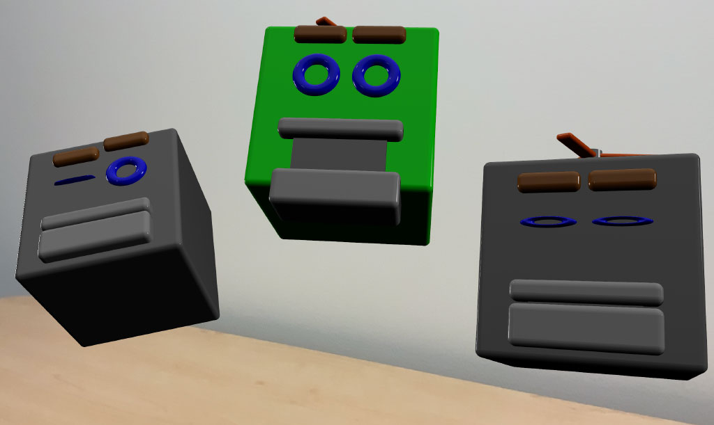

# Combining User Face-Tracking and World Tracking

Track the user's face in an app that displays an AR experience with the rear camera. 

## Overview

When tracking users' faces in a world-tracking session, ARKit incorporates information from both the front and rear camera feeds in the AR experience. In addition to tracking the physical environment using the rear camera, ARKit uses the front camera to deliver an anchor that provides the position and expression of the user's face. 

To demonstrate applying the user's face while world-tracking, this sample app lets the user place robot heads that reflect the user's facial expression.



## Configure and Start the Session

This app tracks the user's face in a world-tracking session on iOS 13 and iPad OS 13 or later, on devices with a front TrueDepth camera that return `true` to [`supportsUserFaceTracking`][6]. To prevent the app from running an unsupported configuration, check whether the iOS device supports simultaneous world and user face-tracking. 

``` swift
guard ARWorldTrackingConfiguration.supportsUserFaceTracking else {
    fatalError("This sample code requires iOS 13 / iPad OS 13, and an iOS device with a front TrueDepth camera. Note: 2020 iPads do not support user face-tracking while world tracking.")
}
```

If the device running the app doesn’t support user face-tracking in a world-tracking session, the sample project will stop. In your app, consider gracefully degrading the AR experience in this case, such as by presenting the user with an error message and continuing the experience without it.

The sample app sets the [`userFaceTrackingEnabled`][1] property to `true` on the world-tracking configuration when app loads the view controller.

``` swift
configuration.userFaceTrackingEnabled = true
```

The sample app then starts the session by running the configuration when the view controller is about to appear onscreen.

``` swift
override func viewWillAppear(_ animated: Bool) {
    super.viewWillAppear(animated)
    arView.session.run(configuration)
}
```
[View in Source](x-source-tag://RunConfiguration)

## Preview Virtual Content in the Physical Environment

The app checks whether a robot head preview exists and creates one if not. ARKit calls the implementation of [`session(_ session: didUpdate frame:)`][3] every frame, which makes it a good location for a periodic check.

``` swift
func session(_ session: ARSession, didUpdate frame: ARFrame) {
    if headPreview == nil, case .normal = frame.camera.trackingState {
        addHeadPreview()
    }
    //...
```
[View in Source](x-source-tag://AddHeadPreview)

## Detect Changes in the User's Expression 

ARKit provides the app with an updated anchor when the user changes their expression, position, or orientation with respect to the world. If there's an active robot head preview, the app applies these changes to the head. 

``` swift
func session(_ session: ARSession, didUpdate anchors: [ARAnchor]) {
    anchors.compactMap { $0 as? ARFaceAnchor }.forEach { headPreview?.update(with: $0) }
}
```
[View in Source](x-source-tag://UpdateFacialExpression)

## Inspect Expression Information

In the robot head's [`update(with faceAnchor:)`](x-source-tag://InterpretBlendShapes) function, the app reads the user's current expression by interpreting the anchor's *blend shapes*. 

``` swift
let blendShapes = faceAnchor.blendShapes
```

Blend shapes are `Float` values normalized within the range `[0..1]`, with `0` representing the facial feature's rest position, and `1` representing the opposite––the feature in its most pronounced state. To begin processing the values, the app stores them locally by accessing the anchor's [`blendShapes`][4] array. 

``` swift
guard let eyeBlinkLeft = blendShapes[.eyeBlinkLeft] as? Float,
    let eyeBlinkRight = blendShapes[.eyeBlinkRight] as? Float,
    let eyeBrowLeft = blendShapes[.browOuterUpLeft] as? Float,
    let eyeBrowRight = blendShapes[.browOuterUpRight] as? Float,
    let jawOpen = blendShapes[.jawOpen] as? Float,
    let upperLip = blendShapes[.mouthUpperUpLeft] as? Float,
    let tongueOut = blendShapes[.tongueOut] as? Float
    else { return }
```

## React to the User's Expression

Blend shape values can apply in unique ways depending on an app's requirements. The sample app uses blend shapes to make the robot head appear to mimic the user's expression, such as applying the brow and lip values to offset the robot's brow and lip positions. 

``` swift
eyebrowLeftEntity.position.y = originalEyebrowY + 0.03 * eyeBrowLeft
eyebrowRightEntity.position.y = originalEyebrowY + 0.03 * eyeBrowRight
tongueEntity.position.z = 0.1 * tongueOut
jawEntity.position.y = originalJawY - jawHeight * jawOpen
upperLipEntity.position.y = originalUpperLipY + 0.05 * upperLip
```

The entity for the robot's eye opens or closes when the sample app applies the corresponding blend shape value as a scale factor. 

``` swift
eyeLeftEntity.scale.z = 1 - eyeBlinkLeft
eyeRightEntity.scale.z = 1 - eyeBlinkRight
```

## Position the Robot Head

In addition to capturing the user's expression using the front camera, ARKit records the position of the user's face with respect to the world. By design, the user's face anchor is always located behind the rear camera. To serve the goal of mimicking the user with the robot head, the sample app applies the face anchor's position to make the robot head always visible. First, it sets the robot head's initial position equal to that of the camera. 

``` swift
let camera = AnchorEntity(.camera)
arView.scene.addAnchor(camera)

// Attach a robot head to the camera anchor.
let robotHead = RobotHead()
camera.addChild(robotHead)
```

Then the app offsets its z-position in the same amount as the camera's distance from the user's face. 

``` swift
let cameraTransform = parent.transformMatrix(relativeTo: nil)
let faceTransformFromCamera = simd_mul(simd_inverse(cameraTransform), faceAnchor.transform)
self.position.z = -faceTransformFromCamera.columns.3.z
```

## Orient the Robot Head

The sample app also uses the anchor's orientation to direct the front of the robot's head continually toward the camera. It starts by accessing the anchor's orientation. 

``` swift
let rotationEulers = faceTransformFromCamera.eulerAngles
```

Then it adds `pi` to the `y`-Euler angle to turn it on the y-axis. 

``` swift
let mirroredRotation = Transform(pitch: rotationEulers.x, yaw: -rotationEulers.y + .pi, roll: rotationEulers.z)
```

To effect the change, the app applies the updated Euler angles to the robot head's orientation. 

``` swift
self.orientation = mirroredRotation.rotation
```

## Capture the Expression by Placing the Head

To demonstrate the variety of expressions tracked during the session, the sample app places the robot head in the physical environment when the user taps the screen. When the app initially previews the expressions, it positions the robot head at a fixed offset from the camera. When the user taps the screen, the app reanchors the robot head by updating its position to its current world location.

``` swift
@objc
func handleTap(recognizer: UITapGestureRecognizer) {
    guard let robotHeadPreview = headPreview, robotHeadPreview.isEnabled, robotHeadPreview.appearance == .tracked else {
        return
    }
    let headWorldTransform = robotHeadPreview.transformMatrix(relativeTo: nil)
    robotHeadPreview.anchor?.reanchor(.world(transform: headWorldTransform))
    robotHeadPreview.appearance = .anchored
    // ...
```
[View in Source](x-source-tag://HandleTap)

Setting the [`headPreview`](x-source-tag://HeadPreview) to `nil` prevents the app from updating the facial expression in [`session(didUpdate anchors:)`](x-source-tag://AddHeadPreview), which freezes that expression on the placed robot head. 

``` swift
self.headPreview = nil
```

When ARKit calls `session(didUpdate frame:)` again, the app checks whether a robot head preview exists, and creates one if not. 

``` swift
func session(_ session: ARSession, didUpdate frame: ARFrame) {
    if headPreview == nil, case .normal = frame.camera.trackingState {
        addHeadPreview()
    }
    //...
```
[View in Source](x-source-tag://AddHeadPreview)

When the app sets [`headPreview`](x-source-tag://HeadPreview) to `nil`, it creates another robot head preview, continuing the user's ability to place objects and archive additional facial expressions. 

- Note: For more detail about placing virtual content in the real world, see [Placing Objects and Handling 3D Interaction][5].

[1]:https://developer.apple.com/documentation/arkit/arworldtrackingconfiguration/3223422-userfacetrackingenabled
[2]:https://developer.apple.com/documentation/arkit/arworldtrackingconfiguration
[3]:https://developer.apple.com/documentation/arkit/arsessiondelegate/2865611-session
[4]:https://developer.apple.com/documentation/arkit/arfaceanchor/2928251-blendshapes
[5]:https://developer.apple.com/documentation/arkit/world_tracking/placing_objects_and_handling_3d_interaction
[6]:https://developer.apple.com/documentation/arkit/arworldtrackingconfiguration/3223421-supportsuserfacetracking
