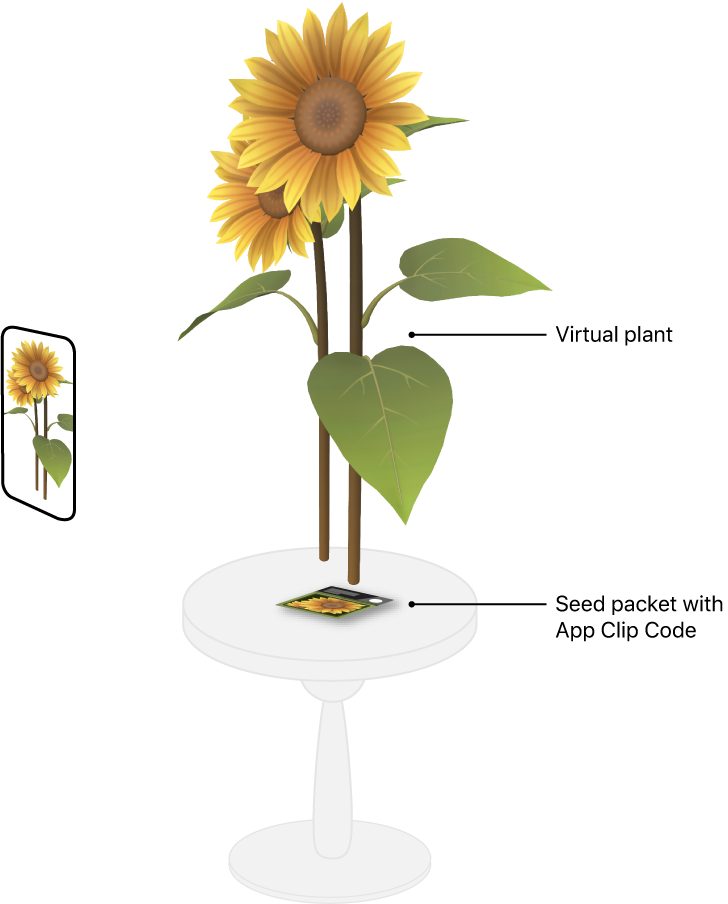

# Interacting with App Clip Codes in AR

Display content and provide services in an AR experience with App Clip Codes.

## Overview

The sample app Seed Shop provides gardeners with previews of fully grown plants. At the nursery, Seed Shop identifies the plant from an App Clip Code on a seed packet, and displays the adult plant in 3D. With the help of AR, the buyer can see, for example, the real height of a typical Mammoth sunflower by inspecting the virtual plant at scale, relative to real objects in the camera feed.



When a user with a device running iOS & iPad OS 14.3 or later scans the seed packet's App Clip Code with their camera or Code Scanner, the sample project's App Clip provides a virtual image of the plant.

If the user indicates they may buy a particular plant in the App Clip experience, Seed Shop suggests the user download the full version of the app to preview the plant in their own garden. This sample project builds the App Clip Code provided on the seed packet at the garden store, allowing the user to view an AR version of the plant before purchase. 

## Configure the Sample Code Project

To configure Seed Shop for code signing, first set a development team on each target. Define a unique bundle ID for the targets, and set the App Clip's parent application identifiers entitlement. 

Next, set the hostname for the App Clip experience URL in the Associated Domains entitlement. The process of setting the hostname requires an explicit App ID, provided by a development team member with Admin permission. For more information on setting a development team, bundle ID, and entitlements, see [Creating an App Clip with Xcode][6].

Run the following command to generate an App Clip Code from the [App Clip Code Generator][15]: 

``` other
AppClipCodeGenerator generate --url https://developer.apple.com/sunfl --index 0 --output ~/Downloads/AppClipCode-sunflower.svg --logo badge
```

To add the sample's App Clip Codes to the environment, you can display them on another device or print them out. For more on creating App Clip Codes, see [Creating App Clip Codes][32].

The App Clip Codes in Seed Shop display on a package of seeds. Add this [image of a seed packet](https://developer.apple.com/sample-code/ar/sunflower.jpg) to your physical environment by displaying it on another device or printing it out.

- Note: You must set the run destination to an actual device. The Simulator doesn't support augmented reality. 

## Ensure Device Support and Run a Session

In [`viewDidLoad`](x-source-tag://ViewDidLoad), the sample app calls [`supportsAppClipCodeTracking`][33] to check if the device contains the Apple Neural Engine (ANE), which App Clip Code tracking requires.

``` swift
guard ARWorldTrackingConfiguration.supportsAppClipCodeTracking else {
    displayUnsupportedDevicePrompt()
    return
```

To search the environment for physical codes, the sample sets [`appClipCodeTrackingEnabled`][16] to `true` before running the session.

``` swift
newConfiguration.appClipCodeTrackingEnabled = true
arView.session.run(newConfiguration)
```

## Identify the App Clip Code that Launched the Experience

When the user points the device at an App Clip Code using the camera or Code Scanner, the system launches its associated App Clip, or if present, the full app. 

In the AR experience, the sample code checks the [`NSUserActivity`][9] invocation URL to identify the App Clip Code that invoked the app or App Clip. 

``` swift
func scene(_ scene: UIScene, willConnectTo session: UISceneSession, options connectionOptions: UIScene.ConnectionOptions) {
    for activity in connectionOptions.userActivities where activity.activityType == NSUserActivityTypeBrowsingWeb {
        appClipCodeURL = activity.webpageURL
```
[View in Source](x-source-tag://SceneWillConnectToSession)

The source of the URL depends on how the App Clip launched: 

* The invocation URL is the `_XCAppClipURL` scheme environment variable when Xcode launches the app or App Clip. For more information, see [Testing Your App Clip’s Launch Experience][5]. 
* The invocation URL is the invoking App Clip Code's URL when the system launches the app or App Clip in the device's camera feed or through the Code Scanner.

There may be multiple App Clip Codes visible in the camera feed that share the same [`url`][2]; for more information, see [`ARAppClipCodeAnchor`][24]. 

If an app interacts with a single App Clip Code, the app can limit its interaction with App Clip Codes that encode the invocation URL. For simplicity, the sample allows the user to scan any associated App Clip Code. However, because the sample app downloads custom assets over the web per App Clip Code, the sample app begins downloading assets for the invocation URL immediately, in anticipation that ARKit will recognize the invoking App Clip Code in the camera feed.

``` swift
process(productKey: getProductKey(from: appClipCodeLaunchURL), initializePreview: false)
```

## Guide the User with Messaging

The device may pan away from the App Clip Code that launched the experience in the time it takes for the system to transition from the camera or Code Scanner to the app or App Clip. In the event ARKit doesn't immediately find the App Clip Code in the camera feed, the sample app displays text instructing the user what to do.

``` swift
class AppClipCodeCoachingOverlayView: UILabel {
    init(parentView: UIView) {
        super.init(frame: .zero)
        text = "Scan code to start"
```
[View in Source](x-source-tag://AppClipCodeCoachingOverlayView)

## Launch the App Clip in Code Scanner

During development, the sample project can launch the App Clip target in Xcode to test the AR experience. After the target launches once, the device scans the test App Clip Code with Code Scanner to invoke the App Clip. 

- Note: Control Center disables Code Scanner by default. Open Control Center Settings on the device and click the "+" button to enable Code Scanner. 

To associate an App Clip Code to the App Clip during development, Seed Shop sets up an App Clip local experience. The sample app requires a local experience URL prefix of `https://developer.apple.com`, and a bundle ID of `com.example.apple-samplecode.AppClipCodesExampleApp1.Clip`. 

For more on local experiences, see [Testing Your App Clip’s Launch Experience][8].

## Set Up an App Clip Experience in App Store Connect

At runtime, the system checks the App Clip registry in App Store Connect to ensure an App Clip associates to an App Clip Code before allowing the app access to the App Clip Code URL. For more information, see [`url`][2].

To decode App Clip Code URLs, Seed Shop sets up an App Clip experience in App Store Connect, and defines the App Clip experience URL of `https://developer.apple.com`. The value of the App Clip experience URL maps to a server that's unique and depends on the development team. For more information, see [Set up an App Clip experience][3].

The app generates App Clip Codes that associate to the App Clip experience in App Store Connect by uploading a CSV file containing the App Clip Code URLs. The fully qualified domain name of each URL matches the App Clip experience URL. The URL suffix identifies the context-specific items or locations with which the App Clip interacts. The sample app identifies a seed packet for a sunflower. To create an App Clip Code for the sunflower, the sample requires a CSV file containing the URL:
``` other
https://developer.apple.com/sunfl
```
When testers view App Clip Codes to launch the App Clip or decode [`ARAppClipCodeAnchor`][24] URLs in an AR experience, the framework refers to the device's local experience. Otherwise, the system displays the App Clip card in the device camera, and allows [`ARAppClipCodeAnchor`][24] URL decoding, only for App Clip experience URLs of app-review approved App Clips. For more information, see [Test an App Clip Experience][34]. 

- Important: During testing in the TestFlight app, the three experience URLs in App Store Connect's TestFlight area change the invocation URL the system passes into the App Clip, but they don't affect [`ARAppClipCodeAnchor`][24] URL decoding.

## Configure the Server and Targets for App Site Association

App Store Connect allows an app to define a particular App Clip experience URL if the server hosting the URL's domain approves of it via Apple App Site Association. In addition, the framework performs an equivalent runtime check before allowing the App Clip or parent app to decode [`ARAppClipCodeAnchor`][4] URLs that are within the App Clip experience's domain. This check occurs for local and App Store Connect experiences. To express approval, the server provides the App Clip's and parent app's fully qualified application identifiers in an Apple App Site Association (AASA) file's `appclips` node. 

``` other
"appclips": {
    "apps": [
        "A93A5CM278.com.example.apple-samplecode.AppClipCodesExampleApp1.Clip",
        "A93A5CM278.com.example.apple-samplecode.AppClipCodesExampleApp1"
    ]
}
```
Seed Shop requires the AASA file that the Apple Developer website hosts at [https://developer.apple.com/.well-known/apple-app-site-association][12]. Navigate the URL in Safari and inspect its `appclips` node to see the sample app's AASA configuration.

The sample project enables the Associated Domains capability on both targets. The key's value is the fully qualified domain of the sample project's App Clip experience URL.

``` other
<key>com.apple.developer.associated-domains</key>
<array>
    <string>appclips:developer.apple.com</string>
</array>
```

For more on configuring AASA for App Clips, see [Associating Your App Clip with Your Website][35].

## Recognize an App Clip Code and Decode the URL

When ARKit recognizes an App Clip Code in the camera feed, it instantiates an [`ARAppClipCodeAnchor`][24] and passes it to the [`session:didAdd:anchors:`][23] callback. Since the user succeeded in scanning a code, the sample app hides the instructional text.

``` swift
func session(_ session: ARSession, didAdd anchors: [ARAnchor]) {
    for anchor in anchors {
        if anchor is ARAppClipCodeAnchor {
            // Hide the coaching overlay since ARKit recognized an App Clip Code.
            appClipCodeCoachingOverlay.setCoachingViewHidden(true)
```
[View in Source](x-source-tag://HideScanCodeText)

Access the anchor's URL for context-specific information about the recognized App Clip Code. The URL is `nil` until the anchor's [`urlDecodingState`][19] is [`decoded`][21]. To check for decoding state changes, the sample app monitors the [`session:didUpdate:anchors:`][18] callback. 

``` swift
func session(_ session: ARSession, didUpdate anchors: [ARAnchor]) {
    for anchor in anchors {
        if let appClipCodeAnchor = anchor as? ARAppClipCodeAnchor, appClipCodeAnchor.urlDecodingState != .decoding {
            let decodedURL: URL
            switch appClipCodeAnchor.urlDecodingState {
            case .decoded:
                    decodedURL = appClipCodeAnchor.url!
                    if !decodedURLs.contains(decodedURL) {
                        decodedURLs.append(decodedURL)
                        process(productKey: getProductKey(from: decodedURL))
```
[View in Source](x-source-tag://SessionDidUpdateAnchors)

If Seed Shop fails to decode the URL, the sample project uses a test URL.

``` swift
var testAppClipCodeURL = URL(string: "https://developer.apple.com/sunfl")!
```
[View in Source](x-source-tag://TestAppClipCodeURL)

For more on URL decoding failure, see [`failed`][22].

- Note: The sample project bundles seed packaging material that displays App Clip Codes, but an app might situate App Clip Codes differently. For detailed guidance on displaying App Clip Codes in the environment, see [App Clip Code Human Interface Guidelines][17].

## Retrieve a Product's 3D Model

When ARKit decodes an App Clip Code's URL, the sample app parses the URL suffix to get the product name. 

``` swift
func getProductKey(from url: URL) -> String { return url.lastPathComponent }
```
[View in Source](x-source-tag://GetProductKey)

The app implements a custom URL mapping system using the project's [`modelURLFor`](x-source-tag://ModelURLFor) dictionary. Each dictionary key is an App Clip Code's URL suffix, and the value represents the seed packet's corresponding grown plant 3D asset.

``` swift
let modelURLFor: [String: URL] = [
    "sunfl": URL(string: "https://developer.apple.com/sample-code/ar/sunflower.usdz")!
]
```
[View in Source](x-source-tag://ModelURLFor)

The sample app downloads the asset and prepares the 3D model using the mapped `contentURL`.

```swift
extension ViewController {
    func process(productKey: String, initializePreview: Bool = true) {
        if let modelURL = modelURLFor[productKey] {
            process(modelURL: modelURL, productKey: productKey)

func process(modelURL: URL, productKey: String) {
    let contentLoad = CachingWebLoader.shared.cachedWebLoad(url: modelURL)
```

## Search for Product Packaging

The sample project's URL mapping system includes an image of the product's packaging material on which to place the product's 3D model in the environment. 

``` swift
let imageURLFor: [String: URL] = [
    "sunfl": URL(string: "https://developer.apple.com/sample-code/ar/sunflower.jpg")!
]
```
[View in Source](x-source-tag://ImageURLFor)

ARKit estimates the 3D position and orientation of each [`ARAppClipCodeAnchor`][24], but [`ARImageAnchor`][27] serves as a better platform on which to place virtual content for several reasons:
* Small physical size impacts ARKit's tracking accuracy, and App Clip Codes typically run small on product packaging 
or in an advertisement. 
* ARKit manages the removal of App Clip Code anchors from the session whereas the app controls whether to remove an image anchor. As a result, the image anchor is less likely to go away.

- Important: An app may require another content anchoring technique, such as placing virtual content instantly after retrieving a position on a nearby horizontal or vertical plane. To ray cast on horizontal planes, see [Placing Objects and Handling 3D Interaction][29]. 

To search the environment for the product's packaging image, the sample downloads the image that the mapping URL references and then creates an [`ARReferenceImage`][28].

``` swift
func process(imageURL: URL, productKey: String, initializeImageAnchor: Bool) {
    if initializeImageAnchor {
        let imageLoader = CachingWebLoader.shared.cachedWebLoad(url: imageURL) { [weak self] url in
            DispatchQueue.global(qos: .userInitiated).async {
                if
                    let dataProvider = CGDataProvider(url: url as CFURL),
                    let image = CGImage(
                        jpegDataProviderSource: dataProvider,
                        decode: nil,
                        shouldInterpolate: false,
                        intent: .absoluteColorimetric
                    )
                {
                    let modelAnchorImage = ARReferenceImage(
                        image,
                        orientation: .up,
                        // Note: the width of the sample seed packet is about 8cm.
                        physicalWidth: 0.08
                    )
```
[View in Source](x-source-tag://ProcessImageURL)

For more information about image tracking, see [Tracking and Altering Images][26].

## Display the 3D Asset

When the user pans the device from the scanned App Clip Code to its downloaded packaging image, ARKit identifies the seed packet's real-world location and displays the full-grown plant on top.


When ARKit recognizes the packaging image, the session creates an image anchor and passes it into the [`session:didAdd:anchors:`][23] callback. The app displays the virtual product on top of the image by calling its [`present(_:on)`](x-source-tag://Present) function. 

``` swift
if let imageAnchorForModel = self?.imageAnchorFor[productKey], let self = self {
    self.modelFor[productKey]!.present(on: imageAnchorForModel)
```

As the user views the virtual plant, the App Clip waits for the user to scan another seed packet. During this time, the App Clip can provide information about the features of the full app. For example, the Seed Shop App Clip might offer the user the ability to download the full app to preview the full-grown plant in their garden. For recommendations about showcasing an app in an App Clip, see [App Clip Human Interface Guidelines][30]. 

[1]:https://developer.apple.com/documentation/app_clips
[2]:https://developer.apple.com/documentation/arkit/arappclipcodeanchor/3697075-url
[3]:https://help.apple.com/app-store-connect/#/dev5b665db74
[4]:https://developer.apple.com/documentation/arkit/arappclipcodeanchor
[5]:https://developer.apple.com/documentation/app_clips/testing_your_app_clip_s_launch_experience#3626842
[6]:https://developer.apple.com/documentation/app_clips/creating_an_app_clip_with_xcode#3604097
[7]:https://developer.apple.com/documentation/app_clips/testing_your_app_clip_s_launch_experience#3626840
[8]:https://developer.apple.com/documentation/app_clips/testing_your_app_clip_s_launch_experience#3671998
[9]:https://developer.apple.com/documentation/foundation/nsuseractivity
[10]:https://developer.apple.com/documentation/foundation/nsuseractivity/1418086-webpageurl
[11]:https://developer.apple.com/documentation/foundation/nsuseractivitytypebrowsingweb
[12]:https://developer.apple.com/.well-known/apple-app-site-association
[13]:https://developer.apple.com/documentation/app_clips/configuring_your_app_clip_s_launch_experience
[14]:https://developer.apple.com/documentation/app_clips/creating_an_app_clip_with_xcode
[15]:https://developer.apple.com/app-clips/resources/
[16]:https://developer.apple.com/documentation/arkit/arworldtrackingconfiguration/3697085-appclipcodetrackingenabled
[17]:https://developer.apple.com/design/human-interface-guidelines/app-clips/overview/app-clip-codes/
[18]:https://developer.apple.com/documentation/arkit/arsessiondelegate/2865624-session
[19]:https://developer.apple.com/documentation/arkit/arappclipcodeanchor/3697076-urldecodingstate
[20]:https://developer.apple.com/documentation/arkit/arappclipcodeanchor/urldecodingstate/decoding
[21]:https://developer.apple.com/documentation/arkit/arappclipcodeanchor/urldecodingstate/decoded
[22]:https://developer.apple.com/documentation/arkit/arappclipcodeanchor/urldecodingstate/failed
[23]:https://developer.apple.com/documentation/arkit/arsessiondelegate/2865617-session
[24]:https://developer.apple.com/documentation/arkit/arappclipcodeanchor
[25]:https://developer.apple.com/documentation/uikit/uiviewcontroller/1621495-viewdidload
[26]:https://developer.apple.com/documentation/arkit/content_anchors/tracking_and_altering_images
[27]:https://developer.apple.com/documentation/arkit/arimageanchor
[28]:https://developer.apple.com/documentation/arkit/arreferenceimage
[29]:https://developer.apple.com/documentation/arkit/environmental_analysis/placing_objects_and_handling_3d_interaction
[30]:https://developer.apple.com/design/human-interface-guidelines/app-clips/overview/
[32]:https://developer.apple.com/documentation/app_clips/creating_app_clip_codes
[33]:https://developer.apple.com/documentation/arkit/arworldtrackingconfiguration/3697086-supportsappclipcodetracking
[34]:https://help.apple.com/app-store-connect/#/devbc57e2ec6
[35]:https://developer.apple.com/documentation/app_clips/associating_your_app_clip_with_your_website
