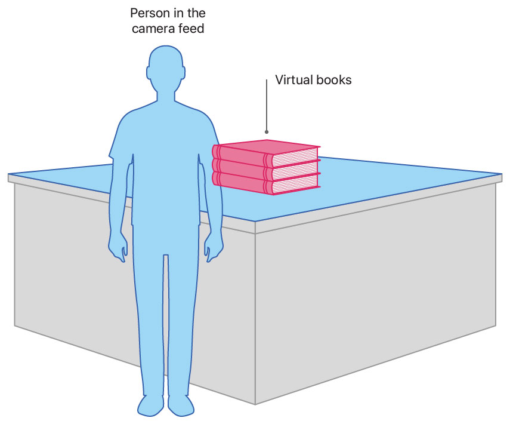
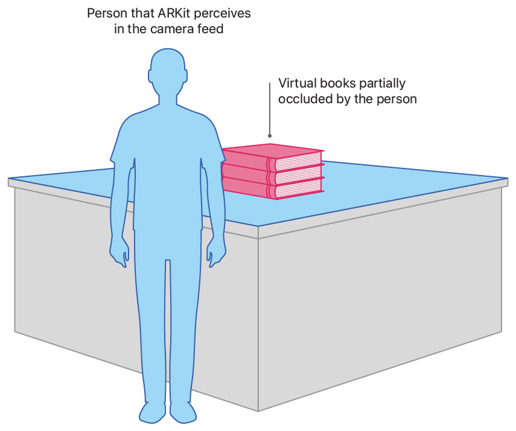
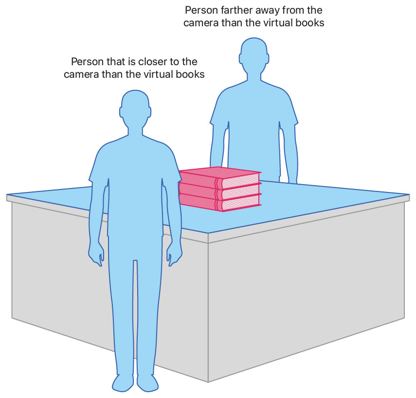
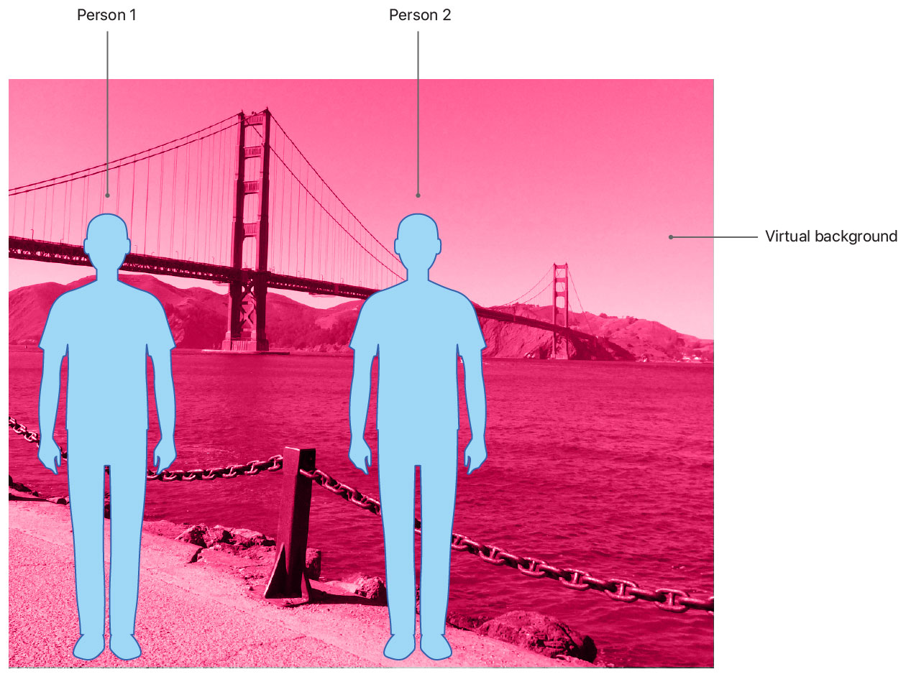

# Occluding Virtual Content with People

Cover your app’s virtual content with people that ARKit perceives in the camera feed.

## Overview

By default, virtual content covers anything in the camera feed. For example, when a person passes in front of a virtual object, the object is drawn on top of the person, which can break the illusion of the AR experience. 



To cover your app's virtual content with people that ARKit perceives in the camera feed, you enable *people occlusion*. Your app can then render a virtual object behind people who pass in front of the camera. ARKit accomplishes the occlusion by identifying regions in the camera feed where people reside, and preventing virtual content from drawing into that region's pixels.



This sample renders its graphics using RealityKit, but you can follow the same steps to use people occlusion with SceneKit. To enable people occlusion in Metal apps, see [`Effecting People Occlusion in Custom Renderers`][4].

## Verify Device Support for People Occlusion

People occlusion is supported on Apple A12 and later devices. Before attempting to enable people occlusion, verify that the user's device supports it. 

``` swift
guard ARWorldTrackingConfiguration.supportsFrameSemantics(.personSegmentationWithDepth) else {
    fatalError("People occlusion is not supported on this device.")
}
```

- Note: If your device doesn't support people occlusion, the sample stops. However, if the user's device doesn't support people occlusion, you should continue your AR experience without it. 

## Enable People Occlusion

If the user's device supports people occlusion, enable it by adding the [`personSegmentationWithDepth`][2] option to your configuration's frame semantics. 

``` swift
config.frameSemantics.insert(.personSegmentationWithDepth)
```

Any time you change your session's [`configuration`][3], rerun the session to effect the configuration change.

``` swift
arView.session.run(config)
```

The `personSegmentationWithDepth` option specifies that a person occludes a virtual object only when the person is closer to the camera than the virtual object.



Alternatively, the [`personSegmentation`][6] frame semantic gives you the option of always occluding virtual content with any people that ARKit perceives in the camera feed irrespective of depth. This technique is useful, for example, in green-screen scenarios. 




## Disable People Occlusion

You might choose to disable people occlusion for performance reasons if, for example, no virtual content is present in the scene, or if the device has reached a serious or critical [`thermalState`][5] (see [`ThermalState`][7]). To temporarily disable people occlusion, remove that option from your app's [`frameSemantics`][1].

``` swift
config.frameSemantics.remove(.personSegmentationWithDepth)
```

Then, rerun your session to effect the configuration change.

``` swift
arView.session.run(config)
```


[1]:https://developer.apple.com/documentation/arkit/arconfiguration/3089121-framesemantics
[2]:https://developer.apple.com/documentation/arkit/arconfiguration/framesemantics/3194576-personsegmentationwithdepth
[3]:https://developer.apple.com/documentation/arkit/arsession/2865609-configuration
[4]:https://developer.apple.com/documentation/arkit/effecting_people_occlusion_in_custom_renderers 
[5]:https://developer.apple.com/documentation/foundation/nsprocessinfo/1417480-thermalstate
[6]:https://developer.apple.com/documentation/arkit/arconfiguration/framesemantics/3089125-personsegmentation
[7]:https://developer.apple.com/documentation/foundation/processinfo/thermalstate