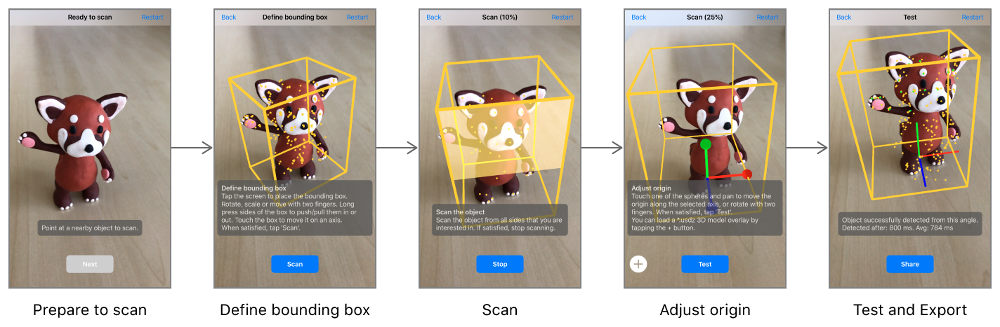

# Scanning and detecting 3D objects

Record spatial features of real-world objects, then use the results to find those objects in the user's environment and trigger AR content.


## Overview

One way to build compelling AR experiences is to recognize features of the user's environment and use them to trigger the appearance of virtual content. For example, a museum app might add interactive 3D visualizations when the user points their device at a displayed sculpture or artifact. 

In iOS 12, you can create such AR experiences by enabling *object detection* in ARKit: Your app provides *reference objects*, which encode three-dimensional spatial features of known real-world objects, and ARKit tells your app when and where it detects the corresponding real-world objects during an AR session.

This sample code project provides multiple ways to make use of object detection:

- Run the app to scan a real-world object and export a reference object file, which you can use in your own apps to detect that object.
- Use the [`ARObjectScanningConfiguration`][00] and [`ARReferenceObject`][01] classes as demonstrated in this sample app to record reference objects as part of your own asset production pipeline.
- Use [`detectionObjects`][02] in a world-tracking AR session to recognize a reference object and create AR interactions.

[00]:https://developer.apple.com/documentation/arkit/arobjectscanningconfiguration
[01]:https://developer.apple.com/documentation/arkit/arreferenceobject
[02]:https://developer.apple.com/documentation/arkit/arworldtrackingconfiguration/2968177-detectionobjects


- Note: ARKit requires an iOS device with A9 processor or later. ARKit is not supported in iOS Simulator.

## Configure your physical environment to enhance object scanning

Set up your physical environment according to the following guidelines. Use these recommendations as a target configuration even if it's unreachable in the specific circumstances of your scanning environment. You can scan objects outside of these specifications if necessary, but they provide ARKit with the conditions most conducive to object scanning. 

- Light the object with an illuminance of 250 to 400 lux, and ensure that it's well-lit from all sides.
- Provide a light temperature of around ~6500 Kelvin (D65)––similar with daylight. Avoid warm or any other tinted light sources.
- Set the object in front of a matte, middle gray background. 

## Scan real-world objects with an iOS app


The programming steps to scan and define a reference object that ARKit can use for detection are simple. (See "Create a Reference Object in an AR Session" below.) However, the fidelity of the reference object you create, and thus your success at detecting that reference object in your own apps, depends on your physical interactions with the object when scanning. Build and run this app on your iOS device to walk through a series of steps for getting high-quality scan data, resulting in reference object files that you can use for detection in your own apps.



1. **Choose an iOS Device.** For easy object scanning, use a recent, high-performance iOS device. Scanned objects can be detected on any ARKit-supported device, but the process of creating a high-quality scan is faster and smoother on a high-performance device.
2. **Position the object.** When first run, the app displays a box that roughly estimates the size of whatever real-world objects appear centered in the camera view. Position the object you want to scan on a surface free of other objects (like an empty tabletop). Then move your device so that the object appears centered in the box, and tap the Next button.
3. **Define bounding box.** Before scanning, you need to tell the app what region of the world contains the object you want to scan. Drag to move the box around in 3D, or press and hold on a side of the box and then drag to resize it. (Or, if you leave the box untouched, you can move around the object and the app will attempt to automatically fit a box around it.) Make sure the bounding box contains only features of the object you want to scan (not those from the environment it's in), then tap the Scan button.
4. **Scan the object.** Move around to look at the object from different angles. For best results, move slowly and avoid abrupt motions. The app highlights parts of the bounding box to indicate when you've scanned enough to recognize the object from the corresponding direction. Be sure to scan on all sides from which you want users of your app to be able to recognize the object. The app automatically proceeds to the next step when a scan is complete, or you can tap the Stop button to proceed manually.
5. **Adjust origin.** The app displays x, y, and z coordinate axis lines showing the object's anchor point, or *origin*. Drag the circles to move the origin relative to the object. In this step you can also use the Add (+) button to load a 3D model in USDZ format. The app displays the model as it would appear in AR upon detecting the real-world object, and uses the model's size to adjust the scale of the reference object. Tap the Test button when done.
6. **Test and export.** The app has now created an [`ARReferenceObject`][01] and has reconfigured its session to detect it. Look at the real-world object from different angles, in various environments and lighting conditions, to verify that ARKit reliably recognizes its position and orientation. Tap the Export button to open a share sheet for saving the finished `.arobject` file. For example, you can easily send it to your development Mac using AirDrop, or send it to the Files app to save it to iCloud Drive.

- Note: An [`ARReferenceObject`][01] contains only the spatial feature information needed for ARKit to recognize the real-world object, and is not a displayable 3D reconstruction of that object.

## Detect reference objects in an AR experience

You can use an Xcode asset catalog to bundle reference objects in an app for use in detection:

1. Open your project's asset catalog, then use the Add button (+) to add a new AR resource group.

2. Drag `.arobject` files from the Finder into the newly created resource group.

3. Optionally, for each reference object, use the inspector to provide a descriptive name for your own use.

- Note: Put all objects you want to look for in the same session into a resource group, and use separate resource groups to hold sets of objects for use in separate sessions. For example, a museum app might use separate sessions (and thus separate resource groups) for recognizing displays in different wings of the museum.

To enable object detection in an AR session, load the reference objects you want to detect as [`ARReferenceObject`][01] instances, provide those objects for the [`detectionObjects`][02] property of an [`ARWorldTrackingConfiguration`][31], and run an [`ARSession`][32] with that configuration:

```swift
let configuration = ARWorldTrackingConfiguration()
guard let referenceObjects = ARReferenceObject.referenceObjects(inGroupNamed: "gallery", bundle: nil) else {
    fatalError("Missing expected asset catalog resources.")
}
configuration.detectionObjects = referenceObjects
sceneView.session.run(configuration)
```

When ARKit detects one of your reference objects, the session automatically adds a corresponding [`ARObjectAnchor`][33] to its list of anchors. To respond to an object being recognized, implement an appropriate [`ARSessionDelegate`][34], [`ARSKViewDelegate`][35], or [`ARSCNViewDelegate`][36] method that reports the new anchor being added to the session. For example, in a SceneKit-based app you can implement  [`renderer(_:didAdd:for:)`][37] to add a 3D asset to the scene, automatically matching the position and orientation of the anchor:

```swift
func renderer(_ renderer: SCNSceneRenderer, didAdd node: SCNNode, for anchor: ARAnchor) {
    if let objectAnchor = anchor as? ARObjectAnchor {
        node.addChildNode(self.model)
    }
}
```

For best results with object scanning and detection, follow these tips:

- ARKit looks for areas of clear, stable visual detail when scanning and detecting objects. Detailed, textured objects work better for detection than plain or reflective objects.
- Object scanning and detection is optimized for objects small enough to fit on a tabletop.
- An object to be detected must have the same shape as the scanned reference object. Rigid objects work better for detection than soft bodies or items that bend, twist, fold, or otherwise change shape.
- Detection works best when the lighting conditions for the real-world object to be detected are similar to those in which the original object was scanned. Consistent indoor lighting works best.

[31]:https://developer.apple.com/documentation/arkit/arworldtrackingconfiguration
[32]:https://developer.apple.com/documentation/arkit/arsession
[33]:https://developer.apple.com/documentation/arkit/arobjectanchor
[34]:https://developer.apple.com/documentation/arkit/arsessiondelegate
[35]:https://developer.apple.com/documentation/arkit/arscnviewdelegate
[36]:https://developer.apple.com/documentation/arkit/arskviewdelegate
[37]:https://developer.apple.com/documentation/arkit/arscnviewdelegate/2865794-renderer

## Create a reference object in an AR session

This sample app provides one way to create reference objects. You can also scan reference objects in your own app—for example, to build asset management tools for defining AR content that goes into other apps you create.

A reference object encodes a slice of the internal spatial-mapping data that ARKit uses to track a device's position and orientation. To enable the high-quality data collection required for object scanning, run a session with [`ARObjectScanningConfiguration`][00]:

``` swift
let configuration = ARObjectScanningConfiguration()
configuration.planeDetection = .horizontal
sceneView.session.run(configuration, options: .resetTracking)
```
[View in Source](x-source-tag://ARObjectScanningConfiguration)

During your object-scanning AR session, scan the object from various angles to make sure you collect enough spatial data to recognize it. (If you're building your own object-scanning tools, help users walk through the same steps this sample app provides.) 

After scanning, call [`createReferenceObject(transform:center:extent:completionHandler:)`][22] to produce an [`ARReferenceObject`][01] from a region of the user environment mapped by the session:

``` swift
// Extract the reference object based on the position & orientation of the bounding box.
sceneView.session.createReferenceObject(
    transform: boundingBox.simdWorldTransform,
    center: SIMD3<Float>(), extent: boundingBox.extent,
    completionHandler: { object, error in
        if let referenceObject = object {
            // Adjust the object's origin with the user-provided transform.
            self.scannedReferenceObject = referenceObject.applyingTransform(origin.simdTransform)
            self.scannedReferenceObject!.name = self.scannedObject.scanName
            
            if let referenceObjectToMerge = ViewController.instance?.referenceObjectToMerge {
                ViewController.instance?.referenceObjectToMerge = nil
                
                // Show activity indicator during the merge.
                ViewController.instance?.showAlert(title: "", message: "Merging previous scan into this scan...", buttonTitle: nil)
                
                // Try to merge the object which was just scanned with the existing one.
                self.scannedReferenceObject?.mergeInBackground(with: referenceObjectToMerge, completion: { (mergedObject, error) in

                    if let mergedObject = mergedObject {
                        self.scannedReferenceObject = mergedObject
                        ViewController.instance?.showAlert(title: "Merge successful",
                                                           message: "The previous scan has been merged into this scan.", buttonTitle: "OK")
                        creationFinished(self.scannedReferenceObject)

                    } else {
                        print("Error: Failed to merge scans. \(error?.localizedDescription ?? "")")
                        let message = """
                                Merging the previous scan into this scan failed. Please make sure that
                                there is sufficient overlap between both scans and that the lighting
                                environment hasn't changed drastically.
                                Which scan do you want to use for testing?
                                """
                        let thisScan = UIAlertAction(title: "Use This Scan", style: .default) { _ in
                            creationFinished(self.scannedReferenceObject)
                        }
                        let previousScan = UIAlertAction(title: "Use Previous Scan", style: .default) { _ in
                            self.scannedReferenceObject = referenceObjectToMerge
                            creationFinished(self.scannedReferenceObject)
                        }
                        ViewController.instance?.showAlert(title: "Merge failed", message: message, actions: [thisScan, previousScan])
                    }
                })
            } else {
                creationFinished(self.scannedReferenceObject)
            }
        } else {
            print("Error: Failed to create reference object. \(error!.localizedDescription)")
            creationFinished(nil)
        }
    })
```
[View in Source](x-source-tag://ExtractReferenceObject)

When detecting a reference object, ARKit reports its position based on the origin the reference object defines. If you want to place virtual content that appears to sit on the same surface as the real-world object, make sure the reference object's origin is placed at the point where the real-world object sits. To adjust the origin after capturing an [`ARReferenceObject`][01], use the [`applyingTransform(_:)`][24] method.

After you obtain an [`ARReferenceObject`][01], you can either use it immediately for detection (see "Detect Reference Objects in an AR Experience" above) or save it as an `.arobject` file for use in later sessions or other ARKit-based apps. To save an object to a file, use the [`export`][23] method. In that method, you can provide a picture of the real-world object for Xcode to use as a preview image.

[22]:https://developer.apple.com/documentation/arkit/arsession/3001731-createreferenceobjectwithtransfo
[23]:https://developer.apple.com/documentation/arkit/arreferenceobject/2968198-export
[24]:https://developer.apple.com/documentation/arkit/arreferenceobject/2977514-applyingtransform
