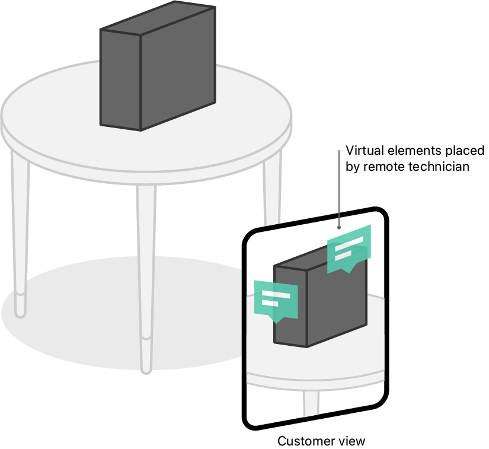
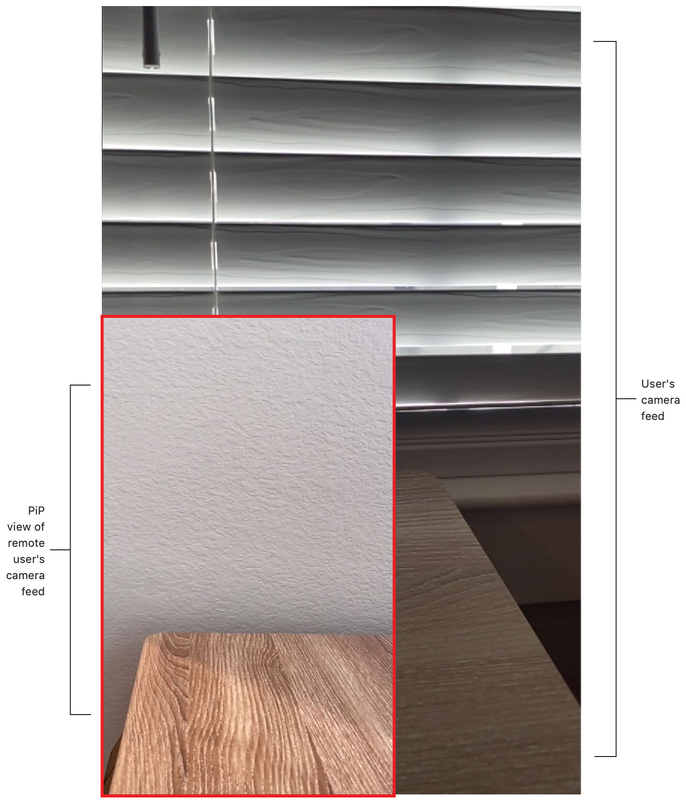
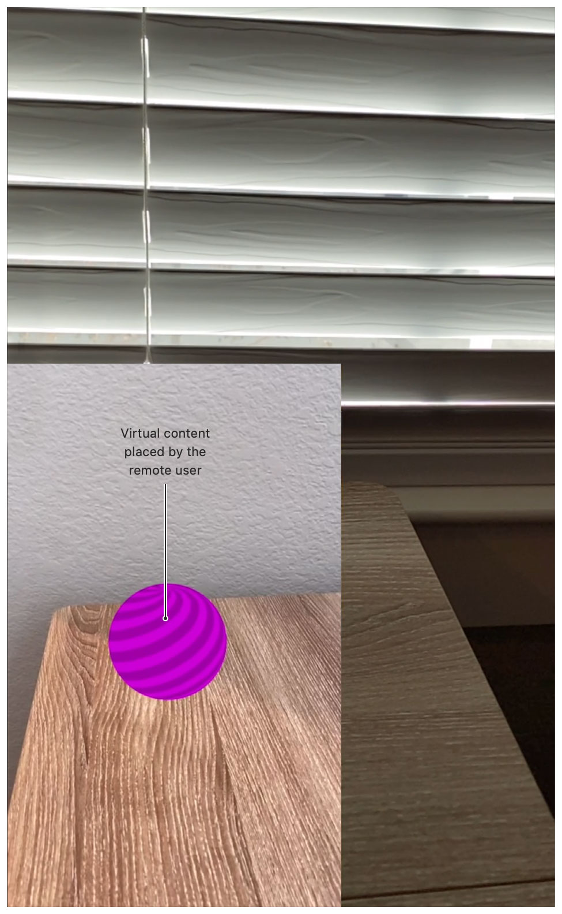

# Streaming an AR Experience

Control an AR experience remotely by transferring sensor and user input over the network.

## Overview

The sample app, AR Stream, shares the augmented camera feed with a peer device, and enables it to take control by interacting with the remote AR experience. For example, a user shares their screen depicting their physical environment with a computer technician who assists the user with troubleshooting a hardware issue. As the user views a broken device resting on a table from different angles, the remote technician interacts with the experience by augmenting the user's camera feed with textual annotations that describe the necessary steps to repair the device.

 

To enable the remote user to see the user's physical environment, AR Stream shares device sensor information across the network. By compressing camera frames with [Video Toolbox][VideoToolbox], the app provides the peer with good visibility of the user's view by displaying the remote experience at a high frame rate. 

AR Stream also sends mathematical details about the user's real-world pose to the remote user to process the peer's touch input. The sample app sends the session’s inverse view and inverse projection matrices to the remote device so it can calculate a location in the user’s environment where the remote user taps. To indicate when the remote user taps the screen, AR Stream places a helpful virtual indicator at the tap location. 

[VideoToolbox]:https://developer.apple.com/documentation/videotoolbox

## Display a Camera Feed and Monitor the Session

AR Stream displays the device's camera feed by configuring a window with a view controller that displays an [`ARView`][ARView] (see the sample project's `Main.storyboard` file). By default, [`ARView`][ARView] runs a session with a world-tracking configuration ([`ARWorldTrackingConfiguration`][ARWorldTrackingConfiguration]). To receive notifications of the view's session events, the project's view controller (see [`ViewController`](x-source-tag://ViewController) in the sample project) assigns itself as the session delegate. 

``` swift
arView.session.delegate = self
```

[ARView]:https://developer.apple.com/documentation/realitykit/arview
[ARSession]:https://developer.apple.com/documentation/arkit/arsession
[ARWorldTrackingConfiguration]:https://developer.apple.com/documentation/arkit/arworldtrackingconfiguration

## Capture Frames

To show the user's physical environment to the remote user, AR Stream uses ReplayKit to open a screen-recording session with [`RPScreenRecorder`][RPScreenRecorder].

``` swift
RPScreenRecorder.shared().startCapture {
```

The screen recording captures the contents of the app's main window, which includes any augmentations that RealityKit may add to the camera feed. In the [`startCapture`][startCapture] closure, the sample project passes the captured screen (`sampleBuffer`) to the [`compressAndSend`](x-source-tag://CompressAndSend) function for eventual transmission over the network. The sample project also passes in the session's current frame to conform the screen captures to the camera-image size. 

``` swift
if type == .video {
    guard let currentFrame = arView.session.currentFrame else { return }
    videoProcessor.compressAndSend(sampleBuffer, arFrame: currentFrame) {
```

- Note: Although [`ARView`][ARView] provides a [`snapshot`][snapshot] function to capture the contents of the view, ReplayKit's screen recording is more conducive to real-time capture.

[RPScreenRecorder]:https://developer.apple.com/documentation/replaykit/rpscreenrecorder
[startCapture]:https://developer.apple.com/documentation/replaykit/rpscreenrecorder/2867291-startcapture
[snapshot]:https://developer.apple.com/documentation/realitykit/arview/3255319-snapshot

## Compress and Send Frames to the Peer

The sample project's [`VideoProcessor`](x-source-tag://VideoProcessor) class implements the [`compressAndSend`](x-source-tag://CompressAndSend) function, which uses [`VTCompressionSession`][VTCompressionSession] to compress the captured video frames. 

``` swift
VTCompressionSessionEncodeFrame(compressionSession,
    imageBuffer: imageBuffer,
    presentationTimeStamp: presentationTimeStamp,
    duration: .invalid,
    frameProperties: nil,
    infoFlagsOut: nil) {
```

To ensure timely compression for the real-time streaming use case of the app, the video processor enables the compression session's [`kVTCompressionPropertyKey_RealTime`][kVTCompressionPropertyKey_RealTime] option.

``` swift
VTSessionSetProperty(compressionSession, key: kVTCompressionPropertyKey_RealTime,
    value: kCFBooleanTrue)
```

After the [`VTCompressionSession`][VTCompressionSession] finishes encoding a frame, the app creates a `VideoFrameData` instance using the compressed frame and the inverse view and projection matrices from the corresponding [`ARFrame`][ARFrame]. 

``` swift
let videoFrameData = VideoFrameData(sampleBuffer: sampleBuffer, arFrame: arFrame)
```

The project serializes and encodes the `VideoFrameData` as JSON data, and passes the data to its `sendHandler`.

``` swift
do {
    let data = try JSONEncoder().encode(videoFrameData)
    // Invoke the caller's handler to send the data.
    sendHandler(data)
} catch {
    fatalError("Failed to encode videoFrameData as JSON with error: "
        + error.localizedDescription)
}
```

The screen-recording closure defines the send handler to contain code that uses [Multipeer Connectivity][MPC] to transmit the video data over the local network. 

``` swift
multipeerSession.sendToAllPeers(data, reliably: true)
```

[VTCompressionSession]:https://developer.apple.com/documentation/videotoolbox/vtcompressionsession-7bn
[kVTCompressionPropertyKey_RealTime]:https://developer.apple.com/documentation/videotoolbox/kvtcompressionpropertykey_realtime
[ARFrame]:https://developer.apple.com/documentation/arkit/arframe
[MPC]:https://developer.apple.com/documentation/multipeerconnectivity

## Receive and Decompress Peer Frames

When the app receives `VideoFrameData` from another device, it decodes the JSON data. 

``` swift
func receivedData(_ data: Data, from peer: MCPeerID) {
    // Try to decode the received data and handle it appropriately.
    if let videoFrameData = try? JSONDecoder().decode(VideoFrameData.self,
        from: data) {
```

To house the transmitted video frame, AR Stream reconstructs a sample buffer. 

``` swift
let sampleBuffer = videoFrameData.makeSampleBuffer()
```

The system can display only uncompressed data, so the video processor decompresses the video frame using [`VTDecompressionSession`][VTDecompressionSession] within its [`decompress`](x-source-tag://DecompressSampleBuffer) function. 

``` swift
VTDecompressionSessionDecodeFrame(decompressionSession,
    sampleBuffer: sampleBuffer,
    flags: [],
    infoFlagsOut: nil) {
```

AR Stream draws the video frame to the screen using its renderer object (see [`Renderer`](x-source-tag://Renderer) in the sample project). The renderer enqueues the frame data for imminent display.

``` swift
// Update the PipView aspect ratio to match the camera-image dimensions.
let width = CGFloat(CVPixelBufferGetWidth(imageBuffer))
let height = CGFloat(CVPixelBufferGetHeight(imageBuffer))
overlayViewController?.setPipViewConstraints(width: width, height: height)

overlayViewController?.renderer.enqueueFrame(
    pixelBuffer: imageBuffer,
    presentationTimeStamp: presentationTimeStamp,
    inverseProjectionMatrix: videoFrameData.inverseProjectionMatrix,
    inverseViewMatrix: videoFrameData.inverseViewMatrix)
```

[VTDecompressionSession]:https://developer.apple.com/documentation/videotoolbox/vtdecompressionsession-7bu

## Display the Remote User's Camera Feed

AR Stream defines an [`MTKView`][MTKView] subclass, [`OverlayViewController`](x-source-tag://OverlayViewController), that displays the remote user's camera feed on top of the [`ARView`][ARView] by placing a *picture-in-picture* (PiP) view at the bottom left of the screen.  



The sample project's [`AppDelegate`](x-source-tag://AppDelegate) configures the PiP view in a secondary window. Because ReplayKit's screen recording captures only the main window, the PiP view displays only the remote user's camera feed.

``` swift
overlayWindow = UIWindow(windowScene: windowScene)

let storyBoard = UIStoryboard(name: "Main", bundle: nil)
let overlayViewController = storyBoard.instantiateViewController(
    identifier: "OverlayViewController")
overlayWindow.rootViewController = overlayViewController
overlayWindow.makeKeyAndVisible()

// Make sure the overlayWindow is always above the main window.
overlayWindow.windowLevel = window.windowLevel + 1
```

[MTKView]:https://developer.apple.com/documentation/metalkit/mtkview

## Send Gestures to the Peer

When the remote user taps the PiP view, the project responds by recording the tap location. 

``` swift
@objc
func tapped(_ sender: UITapGestureRecognizer) {
    guard let view = sender.view else { return }
    let location = sender.location(in: view)
```

The sample project uses the inverse matrices that the user sends to enable the remote user to interact with the user's AR experience. 

``` swift
guard let inverseProjectionMatrix = renderer.lastDrawnInverseProjectionMatrix,
    let inverseViewMatrix = renderer.lastDrawnInverseViewMatrix else {
    return
```

The project converts the tap location and inverse matrices into a ray cast that describes the location and direction in the user's [`ARSession`][ARSession] world coordinate system (see the [`makeRay`](x-source-tag://MakeRay) function in the sample project).

``` swift
let rayQuery = makeRay(from: location,
    viewportSize: view.frame.size,
    inverseProjectionMatrix: simd_float4x4(inverseProjectionMatrix),
    inverseViewMatrix: simd_float4x4(inverseViewMatrix))
```

Then, the sample project encodes the ray cast as JSON data and sends it to the connected peer.

``` swift
let data = try JSONEncoder().encode(rayQuery)
multipeerSession?.sendToAllPeers(data, reliably: true)
```

## Handle Peer Gestures

In the project's [`ViewController`](x-source-tag://ViewController), the [`receivedData`](x-source-tag://ReceivedData) function receives a [`Ray`](x-source-tag://Ray) object when the remote user taps the PiP view. 

``` swift
} else if let rayQuery = try? JSONDecoder().decode(Ray.self, from: data) {
```

To hand the remote user's tap gesture to ARKit as if the user is tapping the screen, the sample project uses the [`Ray`](x-source-tag://Ray) data to create an [`ARTrackedRaycast`][ARTrackedRaycast].  

``` swift
trackedRaycast = arView.session.trackedRaycast(
    ARRaycastQuery(
        origin: rayQuery.origin,
        direction: rayQuery.direction,
        allowing: .estimatedPlane,
        alignment: .any)
    ) {
```

When the tracked ray cast intersects with a surface in the user's environment, the app records the resulting location. 

``` swift
if let result = raycastResults.first {
    marker.transform.matrix = result.worldTransform
```

## Display Virtual Content

To enable the remote user to interact with the user's AR experience, the app places a virtual ball at the location in the environment where the remote user taps. 



- Important: AR Stream displays a virtual ball for simplicity. An app may require different virtual content, such as an arrow that points to a precise spot, or virtual text that explains the importance of a location. For an example app that displays text at a real-world location, see [Screen Space Sample][Screen Space Sample].

The project creates this visual marker using a ball-shaped [ModelEntity][ModelEntity].

[ModelEntity]:https://developer.apple.com/documentation/realitykit/modelentity
[Screen Space Sample]:https://developer.apple.com/documentation/arkit/content_anchors/creating_screen_annotations_for_objects_in_an_ar_experience

``` swift
let marker: AnchorEntity = {
    let entity = AnchorEntity()
    entity.addChild(ModelEntity(mesh: .generateSphere(radius: 0.05)))
    entity.isEnabled = false
    return entity
}()
```

At app launch, the marker is invisible by default as the project readies the marker for display by adding it to the scene. 

``` swift
arView.scene.addAnchor(marker)
```

When the app receives a [`Ray`](x-source-tag://Ray) from the remote user and adjusts the marker's position, the project displays the marker by enabling it. 

``` swift
marker.isEnabled = true
```

[ARTrackedRaycast]:https://developer.apple.com/documentation/arkit/artrackedraycast