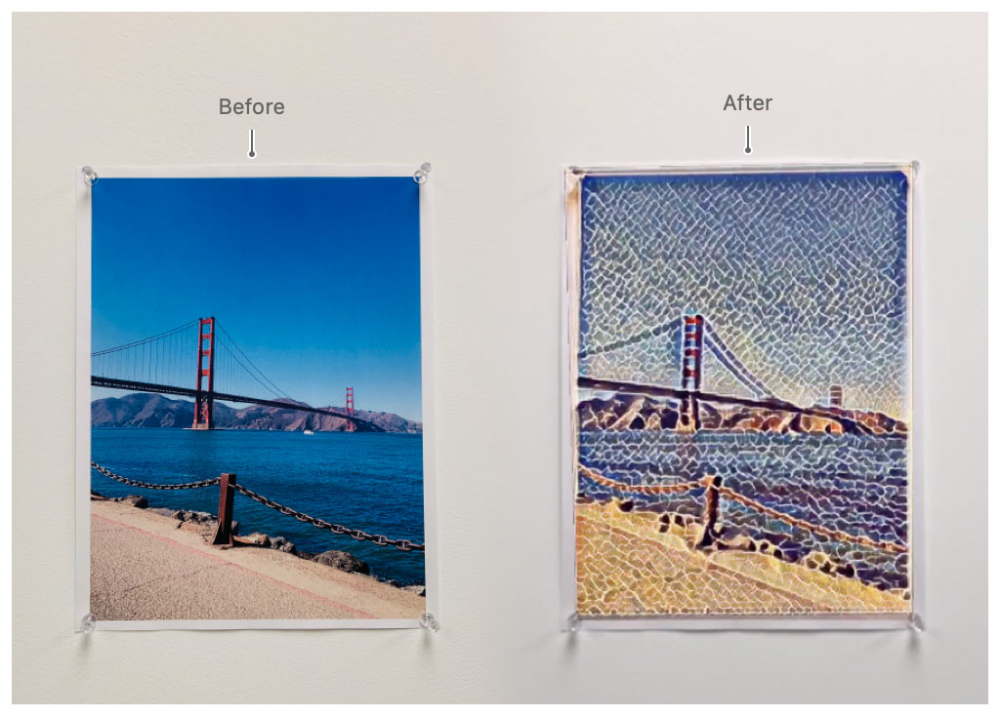
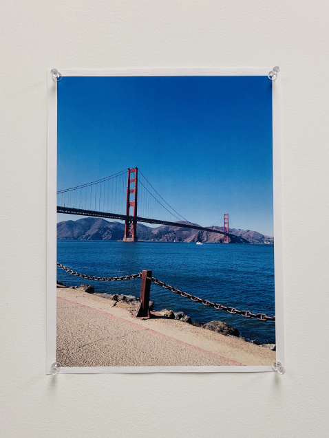
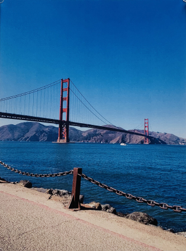
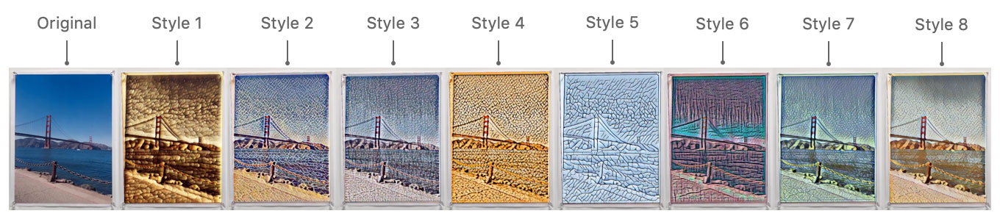
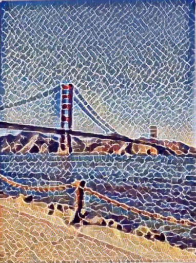
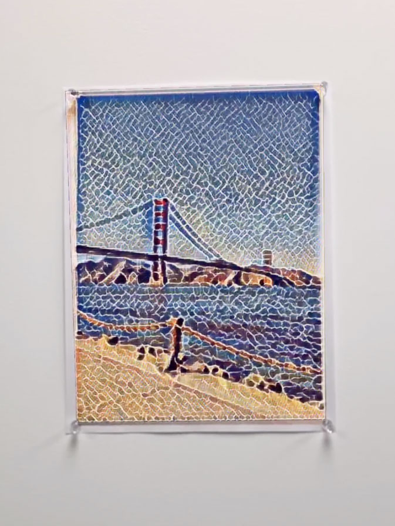

# Tracking and altering images

Create images from rectangular shapes found in the user's environment, and augment their appearance.

## Overview

To demonstrate general image recognition, this sample app uses Vision to detect rectangular shapes in the user's environment that are most likely artwork or photos. Run the app on an iPhone or iPad, and point the device's camera at a movie poster or wall-mounted picture frame. When the app detects a rectangular shape, you extract the pixel data defined by that shape from the camera feed to create an image. 

The sample app changes the appearance of the image by applying a Core ML model that performs a stylistic alteration. By repeating this action in succession, you achieve real-time image processing using a trained neural network. 

To complete the effect of augmenting an image in the user’s environment, you use ARKit’s image tracking feature. ARKit can hold an altered image steady over the original image as the user moves the device in their environment. ARKit also tracks the image if it moves on its own, as when the app recognizes a banner on the side of a bus, and the bus begins to drive away.



This sample app uses SceneKit to render its graphics. 


## Detect rectangular shapes in the user's environment

As shown below, you can use Vision in real-time to check the camera feed for rectangles. You perform this check up to 10 times a second by using [`RectangleDetector`](x-source-tag://RectangleDetector) to schedule a repeating timer with an [`updateInterval`](x-source-tag://UpdateInterval) of 0.1 seconds. 

``` swift
init() {
    self.updateTimer = Timer.scheduledTimer(withTimeInterval: updateInterval, repeats: true) { [weak self] _ in
        if let capturedImage = ViewController.instance?.sceneView.session.currentFrame?.capturedImage {
            self?.search(in: capturedImage)
        }
    }
}
```
[View in Source](x-source-tag://InitializeVisionTimer)

Because Vision requests can be taxing on the processor, check the camera feed no more than 10 times a second. Checking for rectangles more frequently may cause the app's frame rate to decrease, without noticeably improving the app's results.

When you make Vision requests in real-time with an ARKit–based app, you should do so serially. By waiting for one request to finish before invoking another, you ensure that the AR experience remains smooth and free of interruptions. In the [`search`](x-source-tag://SerializeVision) function, you use the [`isBusy`](x-source-tag://IsBusy) flag to ensure you're only checking for one rectangle at a time: 

``` swift
private func search(in pixelBuffer: CVPixelBuffer) {
       guard !isBusy else { return }
       isBusy = true
```
[View in Source](x-source-tag://SerializeVision)

The sample sets the [`isBusy`](x-source-tag://IsBusy) flag to `false` when a Vision request completes or fails.

## Crop the camera feed to an observed rectangle

When Vision finds a rectangle in the camera feed, it provides you with the rectangle's precise coordinates through a [`VNRectangleObservation`][4]. You apply those coordinates to a Core Image perspective correction filter to crop it, leaving you with just the image data inside the rectangular shape. 

``` swift
guard let rectangle = request?.results?.first as? VNRectangleObservation else {
    guard let error = error else { return }
    print("Error: Rectangle detection failed - Vision request returned an error. \(error.localizedDescription)")
    return
}
guard let filter = CIFilter(name: "CIPerspectiveCorrection") else {
    print("Error: Rectangle detection failed - Could not create perspective correction filter.")
    return
}
let width = CGFloat(CVPixelBufferGetWidth(currentCameraImage))
let height = CGFloat(CVPixelBufferGetHeight(currentCameraImage))
let topLeft = CGPoint(x: rectangle.topLeft.x * width, y: rectangle.topLeft.y * height)
let topRight = CGPoint(x: rectangle.topRight.x * width, y: rectangle.topRight.y * height)
let bottomLeft = CGPoint(x: rectangle.bottomLeft.x * width, y: rectangle.bottomLeft.y * height)
let bottomRight = CGPoint(x: rectangle.bottomRight.x * width, y: rectangle.bottomRight.y * height)

filter.setValue(CIVector(cgPoint: topLeft), forKey: "inputTopLeft")
filter.setValue(CIVector(cgPoint: topRight), forKey: "inputTopRight")
filter.setValue(CIVector(cgPoint: bottomLeft), forKey: "inputBottomLeft")
filter.setValue(CIVector(cgPoint: bottomRight), forKey: "inputBottomRight")

let ciImage = CIImage(cvPixelBuffer: currentCameraImage).oriented(.up)
filter.setValue(ciImage, forKey: kCIInputImageKey)

guard let perspectiveImage: CIImage = filter.value(forKey: kCIOutputImageKey) as? CIImage else {
    print("Error: Rectangle detection failed - perspective correction filter has no output image.")
    return
}
delegate?.rectangleFound(rectangleContent: perspectiveImage)
```
[View in Source](x-source-tag://CropCameraImage)

Using the first image in the Overview, the camera image is: 

 

The cropped result is: 



## Create a reference image

To prepare to track the cropped image, you create an [`ARReferenceImage`][1], which provides ARKit with everything it needs, like its look and physical size, to locate that image in the physical environment. 

``` swift
let possibleReferenceImage = ARReferenceImage(referenceImagePixelBuffer, orientation: .up, physicalWidth: CGFloat(0.5))
```
[View in Source](x-source-tag://CreateReferenceImage)

ARKit requires that reference images contain sufficient detail to be recognizable; for example, ARKit can't track an image that is a solid color with no features. To ensure ARKit can track a reference image, you validate it first before attempting to use it.   

``` swift
possibleReferenceImage.validate { [weak self] (error) in
    if let error = error {
        print("Reference image validation failed: \(error.localizedDescription)")
        return
    }
```
[View in Source](x-source-tag://CreateReferenceImage)

## Track the image using ARKit 

Provide the reference image to ARKit to get updates on where the image lies in the camera feed when the user moves their device. Do that by creating an image tracking session and passing the reference image in to the configuration's [`trackingImages`][9] property. 

``` swift
let configuration = ARImageTrackingConfiguration()
configuration.maximumNumberOfTrackedImages = 1
configuration.trackingImages = trackingImages
sceneView.session.run(configuration, options: runOptions)
```
[View in Source](x-source-tag://ImageTrackingSession)

Vision made the initial observation about where the image lies in 2D space in the camera feed, but ARKit resolves its location in 3D space, in the physical environment. When ARKit succeeds in recognizing the image, it creates an [`ARImageAnchor`][2] and a SceneKit node at the right position. You save the anchor and node that ARKit gives you by passing them to an [`AlteredImage`](x-source-tag://AlteredImage) object. 

``` swift
func renderer(_ renderer: SCNSceneRenderer, didAdd node: SCNNode, for anchor: ARAnchor) {
    alteredImage?.add(anchor, node: node)
    setMessageHidden(true)
}
```
[View in Source](x-source-tag://ImageWasRecognized)

## Alter the image's appearance using Core ML 

This sample app is bundled with a Core ML model that performs image processing. Given an input image and an integer index, the model outputs a visually modified version of that image in one of eight different styles. The particular style of the output depends on the value of the index you pass in. The first style resembles burned paper, the second style resembles a mosaic, and there are six other styles as shown in the following image.  

 
 

When Vision finds a rectangular shape in the user's environment, you pass the camera's image data defined by that rectangle into a new [`AlteredImage`](x-source-tag://AlteredImage). 

``` swift
guard let newAlteredImage = AlteredImage(rectangleContent, referenceImage: possibleReferenceImage) else { return }
```
[View in Source](x-source-tag://CreateReferenceImage)

The following code shows how you choose the artistic style to apply to the image by inputting the integer index to the Core ML model. Then, you process the image by calling the Core ML model's [`prediction(from:options:)`][6] routine. 

``` swift
let input = StyleTransferModelInput(image: self.modelInputImage, index: self.styleIndexArray)
let output = try AlteredImage.styleTransferModel.prediction(input: input, options: options)
```
[View in Source](x-source-tag://CreateAlteredImage)

The following figure shows the result when you process the input image with a style index of 2. 

 

## Display the altered image in augmented reality

To complete the augmented reality effect, you cover the original image with the altered image. First, add a visualization node to hold the altered image as a child of the node provided by ARKit. 

``` swift
node.addChildNode(visualizationNode)
```
[View in Source](x-source-tag://AddVisualizationNode)

When Core ML produces the output image, you call [`imageAlteringComplete(_:)`](x-source-tag://DisplayAlteredImage) to pass the model's output image into the visualization node's [`display`](x-source-tag://ImageFade) function, where you set the image as the visualization node's contents. 

``` swift
func imageAlteringComplete(_ createdImage: CVPixelBuffer) {
    guard fadeBetweenStyles else { return }
    modelOutputImage = createdImage
    visualizationNode.display(createdImage)
}
```
[View in Source](x-source-tag://DisplayAlteredImage)

The visualization node's contents overlap the original image when SceneKit displays it. In the case of the image above, the following screenshot shows the end result as seen through a user's device: 

 


## Continually update the image's appearance

This sample demonstrates real-time image processing by switching artistic styles over time. By calling `selectNextStyle`, you can make successive alterations of the original image. `styleIndex` is the integer input to the Core ML model that determines the style of the output. 

``` swift
func selectNextStyle() {
    styleIndex = (styleIndex + 1) % numberOfStyles
}
```
[View in Source](x-source-tag://SelectNextStyle)

The sample's [`VisualizationNode`](x-source-tag://VisualizationNode) fades between two images of differing style, which creates the effect that the tracked image is constantly transforming into a new look. You accomplish this effect by defining two SceneKit nodes. One node displays the current altered image, and the other displays the previous altered image. 

``` swift
private let currentImage: SCNNode
private let previousImage: SCNNode
```
[View in Source](x-source-tag://VisualizationNode)

You fade between these two nodes by running an opacity animation: 

``` swift
SCNTransaction.begin()
SCNTransaction.animationDuration = fadeDuration
currentImage.opacity = 1.0
previousImage.opacity = 0.0
SCNTransaction.completionBlock = {
    self.delegate?.visualizationNodeDidFinishFade(self)
}
SCNTransaction.commit()
```
[View in Source](x-source-tag://ImageFade)

When the animation finishes, you begin altering the original image with the next artistic style by calling `createAlteredImage` again:

``` swift
func visualizationNodeDidFinishFade(_ visualizationNode: VisualizationNode) {
    guard fadeBetweenStyles, anchor != nil else { return }
    selectNextStyle()
    createAlteredImage()
}
```
[View in Source](x-source-tag://FadeAnimationComplete)

## Respond to image tracking updates

As part of the image tracking feature, ARKit continues to look for the image throughout the AR session. If the image itself moves, ARKit updates the [`ARImageAnchor`][2] with its corresponding image's new location in the physical environment, and calls your delegate's [`renderer(_:didUpdate:for:)`][3] to notify your app of the change.

``` swift
func renderer(_ renderer: SCNSceneRenderer, didUpdate node: SCNNode, for anchor: ARAnchor) {
    alteredImage?.update(anchor)
}
```
[View in Source](x-source-tag://DidUpdateAnchor)

The sample app tracks a single image at a time. To do that, you invalidate the current image tracking session if an image the app was tracking is no longer visible. This, in turn, enables Vision to start looking for a new rectangular shape in the camera feed. 

``` swift
func update(_ anchor: ARAnchor) {
    if let imageAnchor = anchor as? ARImageAnchor, self.anchor == anchor {
        self.anchor = imageAnchor
        // Reset the timeout if the app is still tracking an image.
        if imageAnchor.isTracked {
            resetImageTrackingTimeout()
        }
    }
}
```
[View in Source](x-source-tag://AnchorWasUpdated)

[1]:https://developer.apple.com/documentation/arkit/arreferenceimage
[2]:https://developer.apple.com/documentation/arkit/arimageanchor
[3]:https://developer.apple.com/documentation/arkit/arscnviewdelegate/2865799-renderer
[4]:https://developer.apple.com/documentation/vision/vnrectangleobservation
[5]:https://developer.apple.com/documentation/arkit/arworldtrackingconfiguration/2968182-maximumnumberoftrackedimages
[6]:https://developer.apple.com/documentation/coreml/mlmodel/2962866-predictions
[7]:https://developer.apple.com/documentation/vision/detecting_objects_in_still_images
[8]:https://developer.apple.com/documentation/arkit/recognizing_and_labeling_arbitrary_objects
[9]:https://developer.apple.com/documentation/arkit/arimagetrackingconfiguration/2968176-trackingimages
