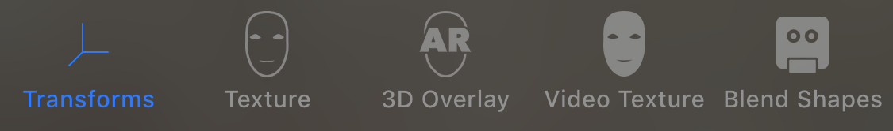

# Tracking and Visualizing Faces

Detect faces in a front-camera AR experience, overlay virtual content, and animate facial expressions in real-time.    

## Overview

This sample app presents a simple interface allowing you to choose between five augmented reality (AR) visualizations on devices with a TrueDepth front-facing camera.

- An overlay of x/y/z axes indicating the ARKit coordinate system tracking the face (and in iOS 12, the position and orientation of each eye).
- The face mesh provided by ARKit, showing automatic estimation of the real-world directional lighting environment, as well as a texture you can use to map 2D imagery onto the face.
- Virtual 3D content that appears to attach to (and interact with) the user's real face.
- Live camera video texture-mapped onto the ARKit face mesh, with which you can create effects that appear to distort the user's real face in 3D. 
- A simple robot character whose facial expression animates to match that of the user, showing how to use ARKit's animation blend shape values to create experiences like the system Animoji app.

Use the tab bar to switch between these modes.



- Important: Face tracking supports devices with Apple Neural Engine in iOS 14 and iPadOS 14 and requires a device with a TrueDepth camera on iOS 13 and iPadOS 13 and earlier. To run the sample app, set the run destination to an actual device; the Simulator doesn’t support augmented reality.

## Start a Face-Tracking Session in a SceneKit View

Like other uses of ARKit, face tracking requires configuring and running a session (an [`ARSession`][0] object) and rendering the camera image together with virtual content in a view. This sample uses [`ARSCNView`][1] to display 3D content with SceneKit, but you can also use SpriteKit or build your own renderer using Metal (see [ARSKView][2] and [Displaying an AR Experience with Metal][3]).

[0]:https://developer.apple.com/documentation/arkit/arsession
[1]:https://developer.apple.com/documentation/arkit/arscnview
[2]:https://developer.apple.com/documentation/arkit/arskview
[3]:https://developer.apple.com/documentation/arkit/displaying_an_ar_experience_with_metal

Face tracking differs from other uses of ARKit in the class you use to configure the session. To enable face tracking, create an instance of [`ARFaceTrackingConfiguration`][5], configure its properties, and pass it to the [`run(_:options:)`][6] method of the AR session associated with your view, as shown here:

[5]:https://developer.apple.com/documentation/arkit/arfacetrackingconfiguration
[6]:https://developer.apple.com/documentation/arkit/arsession/2875735-run

``` swift
guard ARFaceTrackingConfiguration.isSupported else { return }
let configuration = ARFaceTrackingConfiguration()
if #available(iOS 13.0, *) {
    configuration.maximumNumberOfTrackedFaces = ARFaceTrackingConfiguration.supportedNumberOfTrackedFaces
}
configuration.isLightEstimationEnabled = true
sceneView.session.run(configuration, options: [.resetTracking, .removeExistingAnchors])
```
[View in Source](x-source-tag://ARFaceTrackingSetup)

## Track the Position and Orientation of a Face

When face tracking is active, ARKit automatically adds [`ARFaceAnchor`][10] objects to the running AR session, containing information about the user's face, including its position and orientation. (ARKit detects and provides information about only face at a time. If multiple faces are present in the camera image, ARKit chooses the largest or most clearly recognizable face.)

[10]:https://developer.apple.com/documentation/arkit/arfaceanchor

In a SceneKit-based AR experience, you can add 3D content corresponding to a face anchor in the [`renderer(_:nodeFor:)`][11] or [`renderer(_:didAdd:for:)`][12] delegate method. ARKit manages a SceneKit node for the anchor, and updates that node's position and orientation on each frame, so any SceneKit content you add to that node automatically follows the position and orientation of the user's face. 

[11]:https://developer.apple.com/documentation/arkit/arscnviewdelegate/2865801-renderer
[12]:https://developer.apple.com/documentation/arkit/arscnviewdelegate/2865794-renderer

``` swift
func renderer(_ renderer: SCNSceneRenderer, nodeFor anchor: ARAnchor) -> SCNNode? {
    // This class adds AR content only for face anchors.
    guard anchor is ARFaceAnchor else { return nil }
    
    // Load an asset from the app bundle to provide visual content for the anchor.
    contentNode = SCNReferenceNode(named: "coordinateOrigin")
    
    // Add content for eye tracking in iOS 12.
    self.addEyeTransformNodes()
    
    // Provide the node to ARKit for keeping in sync with the face anchor.
    return contentNode
}
```
[View in Source](x-source-tag://ARNodeTracking)

This example uses a convenience extension on [`SCNReferenceNode`][13] to load content from an `.scn` file in the app bundle. The [`renderer(_:nodeFor:)`][1] method provides that node to [`ARSCNView`][1], allowing ARKit to automatically adjust the node's position and orientation to match the tracked face.

[13]:https://developer.apple.com/documentation/scenekit/scnreferencenode

## Use Face Geometry to Model the User's Face

ARKit provides a coarse 3D mesh geometry matching the size, shape, topology, and current facial expression of the user's face. ARKit also provides the [`ARSCNFaceGeometry`][20] class, offering an easy way to visualize this mesh in SceneKit.

[20]:https://developer.apple.com/documentation/arkit/arscnfacegeometry

Your AR experience can use this mesh to place or draw content that appears to attach to the face. For example, by applying a semitransparent texture to this geometry you could paint virtual tattoos or makeup onto the user's skin.

To create a SceneKit face geometry, initialize an [`ARSCNFaceGeometry`][20] object with the Metal device your SceneKit view uses for rendering, and assign that geometry to the SceneKit node tracking the face anchor.

``` swift
func renderer(_ renderer: SCNSceneRenderer, nodeFor anchor: ARAnchor) -> SCNNode? {
    guard let sceneView = renderer as? ARSCNView,
        anchor is ARFaceAnchor else { return nil }
    
    #if targetEnvironment(simulator)
    #error("ARKit is not supported in iOS Simulator. Connect a physical iOS device and select it as your Xcode run destination, or select Generic iOS Device as a build-only destination.")
    #else
    let faceGeometry = ARSCNFaceGeometry(device: sceneView.device!)!
    let material = faceGeometry.firstMaterial!
    
    material.diffuse.contents = #imageLiteral(resourceName: "wireframeTexture") // Example texture map image.
    material.lightingModel = .physicallyBased
    
    contentNode = SCNNode(geometry: faceGeometry)
    #endif
    return contentNode
}
```
[View in Source](x-source-tag://CreateARSCNFaceGeometry)

- Note: This example uses a texture with transparency to create the illusion of colorful grid lines painted onto a real face. You can use the `wireframeTexture.png` image included with this sample code project as a starting point to design your own face textures.

ARKit updates its face mesh conform to the shape of the user's face, even as the user blinks, talks, and makes various expressions. To make the displayed face model follow the user's expressions, retrieve an updated face meshes in the [`renderer(_:didUpdate:for:)`][21] delegate callback, then update the [`ARSCNFaceGeometry`][20] object in your scene to match by passing the new face mesh to its [`update(from:)`][22] method:

[21]:https://developer.apple.com/documentation/arkit/arscnviewdelegate/2865799-renderer
[22]:https://developer.apple.com/documentation/arkit/arscnfacegeometry/2928196-update

``` swift
func renderer(_ renderer: SCNSceneRenderer, didUpdate node: SCNNode, for anchor: ARAnchor) {
    guard let faceGeometry = node.geometry as? ARSCNFaceGeometry,
        let faceAnchor = anchor as? ARFaceAnchor
        else { return }
    
    faceGeometry.update(from: faceAnchor.geometry)
}
```
[View in Source](x-source-tag://ARFaceGeometryUpdate)

## Place 3D Content on the User's Face

Another use of the face mesh that ARKit provides is to create *occlusion geometry* in your scene. An occlusion geometry is a 3D model that doesn't render any visible content (allowing the camera image to show through), but obstructs the camera's view of other virtual content in the scene. 

This technique creates the illusion that the real face interacts with virtual objects, even though the face is a 2D camera image and the virtual content is a rendered 3D object. For example, if you place an occlusion geometry and virtual glasses on the user's face, the face can obscure the frame of the glasses.

To create an occlusion geometry for the face, start by creating an [`ARSCNFaceGeometry`][20] object as in the previous example. However, instead of configuring that object's SceneKit material with a visible appearance, set the material to render depth but not color during rendering:

``` swift
let faceGeometry = ARSCNFaceGeometry(device: sceneView.device!)!
faceGeometry.firstMaterial!.colorBufferWriteMask = []
occlusionNode = SCNNode(geometry: faceGeometry)
occlusionNode.renderingOrder = -1
```
[View in Source](x-source-tag://OcclusionMaterial)

Because the material renders depth, other objects rendered by SceneKit correctly appear in front of it or behind it. But because the material doesn't render color, the camera image appears in its place. 

The sample app combines this technique with a SceneKit object positioned in front of the user's eyes, creating an effect where the user's nose realistically obscures the object. This object uses physically-based materials, so it automatically benefits from the real-time directional lighting information that [`ARFaceTrackingConfiguration`][5] provides.

- Note: The `ARFaceGeometry.obj` file included in this sample project represents ARKit's face geometry in a neutral pose. You can use this as a template to design your own 3D art assets for placement on a real face. 

## Map Camera Video onto 3D Face Geometry

For additional creative uses of face tracking, you can texture-map the live 2D video feed from the camera onto the 3D geometry that ARKit provides. After mapping pixels in the camera video onto the corresponding points on ARKit's face mesh, you can modify that mesh, creating illusions such as resizing or distorting the user's face in 3D.

First, create an [`ARSCNFaceGeometry`][20] for the face and assign the camera image to its main material. [`ARSCNView`][1] automatically sets the scene's [`background`][40] material to use the live video feed from the camera, so you can set the geometry to use the same material.

[40]:https://developer.apple.com/documentation/scenekit/scnscene/1523665-background

``` swift
// Show video texture as the diffuse material and disable lighting.
let faceGeometry = ARSCNFaceGeometry(device: sceneView.device!, fillMesh: true)!
let material = faceGeometry.firstMaterial!
material.diffuse.contents = sceneView.scene.background.contents
material.lightingModel = .constant
```
[View in Source](x-source-tag://VideoTexturedFace)

To correctly align the camera image to the face, you'll also need to modify the texture coordinates that SceneKit uses for rendering the image on the geometry. One easy way to perform this mapping is with a SceneKit shader modifier (see the [`SCNShadable`][41] protocol). The shader code here applies the coordinate system transformations needed to convert each vertex position in the mesh from 3D scene space to the 2D image space used by the video texture: 

[41]:https://developer.apple.com/documentation/scenekit/scnshadable

``` metal
// Transform the vertex to the camera coordinate system.
float4 vertexCamera = scn_node.modelViewTransform * _geometry.position;

// Camera projection and perspective divide to get normalized viewport coordinates (clip space).
float4 vertexClipSpace = scn_frame.projectionTransform * vertexCamera;
vertexClipSpace /= vertexClipSpace.w;

// XY in clip space is [-1,1]x[-1,1], so adjust to UV texture coordinates: [0,1]x[0,1].
// Image coordinates are Y-flipped (upper-left origin).
float4 vertexImageSpace = float4(vertexClipSpace.xy * 0.5 + 0.5, 0.0, 1.0);
vertexImageSpace.y = 1.0 - vertexImageSpace.y;

// Apply ARKit's display transform (device orientation * front-facing camera flip).
float4 transformedVertex = displayTransform * vertexImageSpace;

// Output as texture coordinates for use in later rendering stages.
_geometry.texcoords[0] = transformedVertex.xy;
```

When you assign a shader code string to the [`geometry`][42] entry point, SceneKit configures its renderer to automatically run that code on the GPU for each vertex in the mesh. This shader code also needs to know the intended orientation for the camera image, so the sample gets that from the ARKit [`displayTransform(for:viewportSize:)`][43] method and passes it to the shader's `displayTransform` argument:

[42]:https://developer.apple.com/documentation/scenekit/scnshadermodifierentrypoint/1524108-geometry
[43]:https://developer.apple.com/documentation/arkit/arframe/2923543-displaytransform

``` swift
// Pass view-appropriate image transform to the shader modifier so
// that the mapped video lines up correctly with the background video.
let affineTransform = frame.displayTransform(for: .portrait, viewportSize: sceneView.bounds.size)
let transform = SCNMatrix4(affineTransform)
faceGeometry.setValue(SCNMatrix4Invert(transform), forKey: "displayTransform")
```
[View in Source](x-source-tag://VideoTexturedFace)

- Note: This example's shader modifier also applies a constant scale factor to all vertices, causing the user's face to appear larger than life. Try other transformations to distort the face in other ways.

## Animate a Character with Blend Shapes

In addition to the face mesh shown in the earlier examples, ARKit also provides a more abstract representation of the user's facial expressions. You can use this representation (called *blend shapes*) to control animation parameters for your own 2D or 3D assets, creating a character that follows the user's real facial movements and expressions. 

As a basic demonstration of blend shape animation, this sample includes a simple model of a robot character's head, created using SceneKit primitive shapes. (See the `robotHead.scn` file in the source code.) 

To get the user's current facial expression, read the [`blendShapes`][50] dictionary from the face anchor in the [`renderer(_:didUpdate:for:)`][21] delegate callback. Then, examine the key-value pairs in that dictionary to calculate animation parameters for your 3D content and update that content accordingly. 

[50]:https://developer.apple.com/documentation/arkit/arfaceanchor/2928251-blendshapes

``` swift
let blendShapes = faceAnchor.blendShapes
guard let eyeBlinkLeft = blendShapes[.eyeBlinkLeft] as? Float,
    let eyeBlinkRight = blendShapes[.eyeBlinkRight] as? Float,
    let jawOpen = blendShapes[.jawOpen] as? Float
    else { return }
eyeLeftNode.scale.z = 1 - eyeBlinkLeft
eyeRightNode.scale.z = 1 - eyeBlinkRight
jawNode.position.y = originalJawY - jawHeight * jawOpen
```
[View in Source](x-source-tag://BlendShapeAnimation)

There are more than 50 unique [`ARFaceAnchor.BlendShapeLocation`][51] coefficients, of which your app can use as few or as many as necessary to create the artistic effect you want. In this sample, the [`BlendShapeCharacter`](x-source-tag://BlendShapeCharacter) class performs this calculation, mapping the [`eyeBlinkLeft`][52] and [`eyeBlinkRight`][53] parameters to one axis of the [`scale`][54] factor of the robot's eyes, and the [`jawOpen`][55] parameter to offset the position of the robot's jaw.

[51]:https://developer.apple.com/documentation/arkit/arfaceanchor/blendshapelocation
[52]:https://developer.apple.com/documentation/arkit/arfaceanchor/blendshapelocation/2928261-eyeblinkleft
[53]:https://developer.apple.com/documentation/arkit/arfaceanchor/blendshapelocation/2928262-eyeblinkright
[54]:https://developer.apple.com/documentation/scenekit/scnnode/1408050-scale
[55]:https://developer.apple.com/documentation/arkit/arfaceanchor/blendshapelocation/2928236-jawopen

