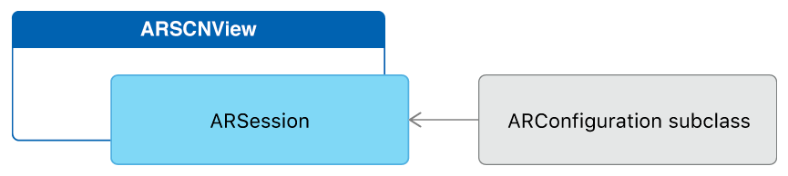

# Tracking and Visualizing Planes

Detect surfaces in the physical environment and visualize their shape and location in 3D space.     

## Overview

This sample app runs an [ARKit][0] world tracking session with content displayed in a SceneKit view. To demonstrate plane detection, the app visualizes the estimated shape of each detected [`ARPlaneAnchor`][14] object, and a bounding rectangle for it. On supported devices, ARKit can recognize many types of real-world surfaces, so the app also labels each detected plane with identifying text.

[0]:https://developer.apple.com/documentation/arkit
[14]:https://developer.apple.com/documentation/arkit/arplaneanchor

- Note: ARKit requires an iOS device with an A9 or later processor. ARKit is not available in iOS Simulator.

## Configure and Run the AR Session

The [`ARSCNView`][1] class is a SceneKit view that includes an [`ARSession`][2] object that manages the motion tracking and image processing required to create an augmented reality (AR) experience. However, to run a session you must provide a session configuration.

[1]:https://developer.apple.com/documentation/arkit/arscnview
[2]:https://developer.apple.com/documentation/arkit/arsession



The [`ARWorldTrackingConfiguration`][3] class provides high-precision motion tracking and enables features to help you place virtual content in relation to real-world surfaces. To start an AR session, create a session configuration object with the options you want (such as plane detection), then call the [`run(_:options:)`][4] method on the [`session`][5] object of your [`ARSCNView`][1] instance:

``` swift
let configuration = ARWorldTrackingConfiguration()
configuration.planeDetection = [.horizontal, .vertical]
sceneView.session.run(configuration)
```
[View in Source](x-source-tag://StartARSession)

[3]:https://developer.apple.com/documentation/arkit/arworldtrackingconfiguration
[4]:https://developer.apple.com/documentation/arkit/arsession/2875735-run
[5]:https://developer.apple.com/documentation/arkit/arscnview/2865796-session

Run your session only when the view that will display it is onscreen.

- Important: If your app requires ARKit for its core functionality, use the `arkit` key in the [`UIRequiredDeviceCapabilities`][7] section of your app's `Info.plist` file to make your app available only on devices that support ARKit. If AR is a secondary feature of your app, use the [`isSupported`][8] property to determine whether to offer AR-based features.

[7]:https://developer.apple.com/library/content/documentation/General/Reference/InfoPlistKeyReference/Articles/iPhoneOSKeys.html#//apple_ref/doc/uid/TP40009252-SW3
[8]:https://developer.apple.com/documentation/arkit/arconfiguration/2923553-issupported

## Place 3D Content for Detected Planes

After you’ve set up your AR session, you can use SceneKit to place virtual content in the view.

When plane detection is enabled, ARKit adds and updates anchors for each detected plane. By default, the [`ARSCNView`][1] class adds an [`SCNNode`][9] object to the SceneKit scene for each anchor. Your view's delegate can implement the [`renderer(_:didAdd:for:)`][10] method to add content to the scene. When you add content as a child of the node corresponding to the anchor, the `ARSCNView` class automatically moves that content as ARKit refines its estimate of the plane's position.

``` swift
func renderer(_ renderer: SCNSceneRenderer, didAdd node: SCNNode, for anchor: ARAnchor) {
    // Place content only for anchors found by plane detection.
    guard let planeAnchor = anchor as? ARPlaneAnchor else { return }
    
    // Create a custom object to visualize the plane geometry and extent.
    let plane = Plane(anchor: planeAnchor, in: sceneView)
    
    // Add the visualization to the ARKit-managed node so that it tracks
    // changes in the plane anchor as plane estimation continues.
    node.addChildNode(plane)
}
```
[View in Source](x-source-tag://PlaceARContent)

[9]:https://developer.apple.com/documentation/scenekit/scnnode
[10]:https://developer.apple.com/documentation/arkit/arscnviewdelegate/2865794-renderer

ARKit offers two ways to track the area of an estimated plane. A plane anchor's [`geometry`][20] describes a convex polygon tightly enclosing all points that ARKit currently estimates to be part of the same plane (easily visualized using [`ARSCNPlaneGeometry`][21]). ARKit also provides a simpler estimate in a plane anchor's [`extent`][22] and [`center`][23], which together describe a rectangular boundary (easily visualized using [`SCNPlane`][12]).

``` swift
// Create a mesh to visualize the estimated shape of the plane.
guard let meshGeometry = ARSCNPlaneGeometry(device: sceneView.device!)
    else { fatalError("Can't create plane geometry") }
meshGeometry.update(from: anchor.geometry)
meshNode = SCNNode(geometry: meshGeometry)

// Create a node to visualize the plane's bounding rectangle.
let extentPlane: SCNPlane = SCNPlane(width: CGFloat(anchor.extent.x), height: CGFloat(anchor.extent.z))
extentNode = SCNNode(geometry: extentPlane)
extentNode.simdPosition = anchor.center

// `SCNPlane` is vertically oriented in its local coordinate space, so
// rotate it to match the orientation of `ARPlaneAnchor`.
extentNode.eulerAngles.x = -.pi / 2
```
[View in Source](x-source-tag://VisualizePlane)

[20]:https://developer.apple.com/documentation/arkit/arplaneanchor/2941025-geometry
[21]:https://developer.apple.com/documentation/arkit/arscnplanegeometry
[22]:https://developer.apple.com/documentation/arkit/arplaneanchor/2882055-extent
[23]:https://developer.apple.com/documentation/arkit/arplaneanchor/2882056-center
[12]:https://developer.apple.com/documentation/scenekit/scnplane


ARKit continually updates its estimates of each detected plane's shape and extent. To show the current estimated shape for each plane, this sample app also implements the [`renderer(_:didUpdate:for:)`][11] method, updating the [`ARSCNPlaneGeometry`][21] and [`SCNPlane`][12] objects to reflect the latest information from ARKit.

``` swift
func renderer(_ renderer: SCNSceneRenderer, didUpdate node: SCNNode, for anchor: ARAnchor) {
    // Update only anchors and nodes set up by `renderer(_:didAdd:for:)`.
    guard let planeAnchor = anchor as? ARPlaneAnchor,
        let plane = node.childNodes.first as? Plane
        else { return }
    
    // Update ARSCNPlaneGeometry to the anchor's new estimated shape.
    if let planeGeometry = plane.meshNode.geometry as? ARSCNPlaneGeometry {
        planeGeometry.update(from: planeAnchor.geometry)
    }

    // Update extent visualization to the anchor's new bounding rectangle.
    if let extentGeometry = plane.extentNode.geometry as? SCNPlane {
        extentGeometry.width = CGFloat(planeAnchor.extent.x)
        extentGeometry.height = CGFloat(planeAnchor.extent.z)
        plane.extentNode.simdPosition = planeAnchor.center
    }
    
    // Update the plane's classification and the text position
    if #available(iOS 12.0, *),
        let classificationNode = plane.classificationNode,
        let classificationGeometry = classificationNode.geometry as? SCNText {
        let currentClassification = planeAnchor.classification.description
        if let oldClassification = classificationGeometry.string as? String, oldClassification != currentClassification {
            classificationGeometry.string = currentClassification
            classificationNode.centerAlign()
        }
    }
    
}
```
[View in Source](x-source-tag://UpdateARContent)

[11]:https://developer.apple.com/documentation/arkit/arscnviewdelegate/2865799-renderer

On iPhone XS, iPhone XS Max, and iPhone XR, ARKit can also classify detected planes, reporting which kind of common real-world surface that plane represents (for example, a table, floor, or wall). In this example, the [`renderer(_:didUpdate:for:)`][11] method also displays and updates a text label to show that information.
